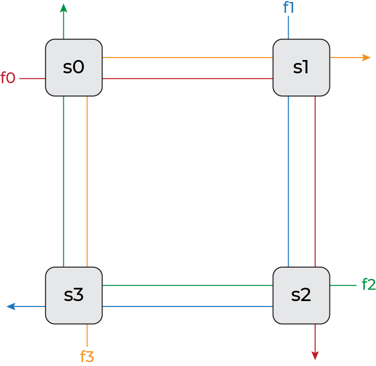

# ECOWCDB: Efficient Computation of Worst-Case Delay-Bounds for Time-Sensitive Networks
Author: Edin Guso

Advisors: Seyed Mohammadhossein Tabatabaee, Stéphan Plassart, Jean-Yves Le Boudec

Institute: Computer Communications and Applications Laboratory 2 (LCA2), École Polytechnique Fédérale de Lausane (EPFL)


# Table of Contents
The readme consists of 2 main parts: Report and Project. Report section includes the project discussion, while the Project section is what one would expect from a regular readme.

- [ECOWCDB](#ecowcdb-efficient-computation-of-worst-case-delay-bounds-for-time-sensitive-networks)
- [Table of Contents](#table-of-contents)
- [Report](#report)
    - [Introduction](#introduction)
    - [Solution](#solution)
        - [Algorithm A](#algorithm-a)
            - [Results](#results)
        - [Runtime](#runtime)
        - [Algorithm B](#algorithm-b)
            - [Results](#results-1)
        - [Algorithm C](#algorithm-c)
            - [Results](#results-2)
        - [Results and Discussion](#results-and-discussion)
        - [Other Contributions](#other-contributions)
            - [Network Generation](#network-generation)
            - [Cut Analysis](#cut-analysis)
            - [Cut Statistics](#cut-statistics)
            - [ECOWCDB](#ecowcdb)
    - [Achievements](#achievements)
    - [Skills](#skills)
    - [Major Events](#major-events)
    - [Self-Assesment](#self-assesment)
- [Project](#project)
    - [Introduction](#introduction-1)
    - [Project Structure](#project-structure)
        - [File Description](#file-description)
    - [Installation](#installation)
        - [Requirements](#requirements)
        - [Detailed Guide](#detailed-guide)
    - [How to Use](#how-to-use)
    - [Future Work](#future-work)
    - [References](#references)
- [Contact](#contact)


# Report

## Introduction
Time-Sensitive Networking (TSN) has emerged as a critical technology in various domains where real-time communication is paramount, such as industrial automation, autonomous vehicles, and multimedia streaming. TSN provides deterministic and bounded latency guarantees, ensuring the timely delivery of time-critical data in networked systems. To support the development and deployment of TSN, the TSN Working Group, comprised of industry experts and researchers, has been instrumental in defining standards that address the stringent requirements of these applications.

Time-sensitive networks require performance guarantees under worst-case scenarios, where delays can be maximized due to factors like congestion, contention, and network topology. Unlike average-case analysis, worst-case analysis considers extreme situations to ensure the network's ability to handle critical communication within strict latency bounds. Computing the exact worst-case delays for time-sensitive networks is known to be an NP-hard problem, posing significant computational challenges.

In the quest to analyze and validate the performance of communication networks, Network Calculus has emerged as a powerful mathematical framework. It provides methods for computing upper bounds on worst-case performance parameters, such as end-to-end delay and backlog [[1]](#references). These upper bounds enable network designers to assess the predictability and performance guarantees of their designs and ensure compliance with real-time requirements.

However, computing accurate upper bounds on worst-case performance in time-sensitive networks remains a complex and computationally intensive task. Existing approaches rely on heuristics to overcome the computational intractability of the problem. 
One notable method is the PLP algorithm, proposed in [[2]](#references). The PLP algorithm leverages linear programming techniques to determine worst-case delay bounds.

PLP works by breaking cyclic dependencies within the network and this is achieved by cutting the network. The selection of cuts significantly impacts the accuracy of worst-case delay bounds. Despite the algorithm's effectiveness, selecting suitable cuts for the PLP algorithm poses a significant challenge due to the exponential number of potential cuts for each network.

In the original implementation of the PLP algorithm, the cut selection process follows a simplistic approach. While their approach ensures the construction of a valid forest, the resulting forest heavily relies on the indexing of the nodes (servers) within the network. Even with favorable indexing, this simple cut selection often leads to sub-optimal delay bounds, depending on the network topology.

In summary, our project focuses on addressing the challenges associated with the selection of cuts in the PLP algorithm for accurately estimating worst-case delay bounds. We aim to investigate and understand the intricate relationship between the size, shape, and composition of cuts, and their impact on the resulting delay bounds. By gaining insights into this relationship, we can develop more efficient and accurate heuristics for selecting good cuts for networks of varying sizes and topologies. Through these contributions, we strive to improve the reliability and efficiency of communication systems operating in time-critical environments.

## Solution
In this section, we present our solution to the challenge of selecting good cuts for the PLP algorithm in order to obtain good worst-case delay bounds in time-sensitive networks. Our solution encompasses a heuristic algorithm designed to address this non-trivial problem, aiming to enhance the efficiency and accuracy of performance analysis in such networks.

Leveraging insights gained from an exhaustive search over all possible cuts for a diverse set of network topologies, we designed an algorithm that effectively selects cuts to achieve good worst-case delay bounds. Through meticulous examination of the results and comprehensive statistical analysis, we have made significant observations that form the basis of our heuristic approach.

Our first key observation is that performing smaller cuts tends to yield better delay bounds. This finding suggests that by minimizing the extent of disruptions within the network, we can improve the overall performance in terms of worst-case delays. Consequently, our heuristic algorithm places emphasis on identifying and selecting cuts that have a smaller impact on the network, contributing to more favorable worst-case delay bounds.

Furthermore, our second significant observation indicates that not cutting the flow of interest generally leads to improved delay bounds. By preserving the integrity of the flow of interest, which typically represents the critical communication path, we ensure that the latency guarantees for time-sensitive applications are maintained. This crucial insight guides our heuristic algorithm to prioritize cuts that avoid interrupting the flow of interest, further enhancing the accuracy of worst-case delay bound estimation.

In addition to these main observations, we have also made a supporting observation related to avoiding cuts on flows that overlap with the flow of interest. Our analysis suggests that such overlapping flows should be preserved whenever possible, as cutting them could introduce additional dependencies and potentially compromise the worst-case delay bounds. However, if cutting is necessary to avoid cyclic dependencies, our heuristic algorithm seeks to place the cut after the overlap. If this is not feasible, the cut is positioned towards the start of the flow, farther away from the overlap. While this supporting observation adds complexity, it provides valuable guidance for achieving good delay bounds when selecting cuts.

To evaluate the effectiveness of our heuristic algorithm, we compared its performance with the optimal cut obtained through exhaustive search. The results of our numerical experiments on various generic network topologies reveal that our heuristic algorithm often achieves comparable worst-case delay bounds to the optimal cut. It is important to acknowledge that finding the optimal delay bound is a highly challenging task due to the computational complexity of the problem. As a result, our heuristic algorithm, although effective, may not necessarily guarantee the identification of the absolute optimal cut. The complexity arises from the exponential number of potential cuts for each network and the intricate relationship between cuts and performance. Despite this limitation, our solution represents a significant step forward in addressing this challenging problem and provides practical and effective means to enhance the reliability and efficiency of communication systems operating in time-critical environments.

In the following sections, we will delve into further details of our solution, describing the implementation of the heuristic algorithm and showcasing the numerical results obtained from our experimentation. Through this comprehensive analysis, we aim to establish the robustness and practical applicability of our solution in the realm of time-sensitive networking.

### Algorithm A
```
Algorithm: Flow-preserving min-cut forest

forest <- []
node_depth <- []
visited <- {}

node <- last node in foi
visited.add(node)
node_depth.append(node, 0)
for every edge=(node1,node2) in reverse(foi):
    visited.add(node1)
    node_depth.append(node1, node2.depth+1)
    forest.append(edge)

while node_depth is not empty:
    node, depth <- node with the smallest depth
    for every neighbour with an edge directed to node:
        if neighbour is not visited:
            visited.add(neighbour)
            node_depth.append(neighbour, node.depth+1)
            forest.append(edge)

return forest
```

#### Results
In this section, we present the numerical results obtained from our experimentation to evaluate the performance of our heuristic algorithm for selecting cuts in the PLP algorithm. We conducted our experiments on a range of generic network topologies, which are shown in the [Network Topologies](#network-topologies) section. These topologies capture various network configurations and characteristics, enabling us to assess the effectiveness and applicability of our solution across different scenarios.

For each network topology, we used the following parameters:
```
Service Rate (Server) = 10Gb/s
Latency (Server) = 10µs
Burst (Flow) = 8Kb
Maximum load (Server) = 50%
```

| Network Topology | Number of Servers | Exhaustive Search | Algorithm A |
|:-:|:-:|:-:|:-:|
| Semi Ring | 12 | 84.65µs | 84.65µs |
| Full Ring | 12 | 149.13µs | 149.13µs |
| Complete Semi Ring | 11 | 109.17µs | 109.17µs |
| Complete Full Ring | 7 | 139.18µs | 139.27µs |
| Mesh | 9 | 89.25µs | 98.39µs |

The presented results demonstrate the effectiveness of our heuristic algorithm in approximating the optimal delay bounds in different network topologies. While the heuristic delay may not always match the optimal delay, it is often very close and achieves comparable performance.

### Runtime
The runtime of the PLP algorithm plays a crucial role in its practical applicability. In this subsection, we discuss the runtime considerations and tractability of the algorithm, highlighting the trade-off between the quality of obtained delay bounds and the computational efficiency.

During our exhaustive search over all possible cuts, we observed an interesting relationship between the size of the cut and the runtime. It became evident that smaller cuts generally resulted in longer runtime. This observation inherently introduces a trade-off between the quality of worst-case delay bounds and the computational efficiency of the PLP algorithm.

To understand the reason behind this trade-off, we delve into the inner workings of the PLP algorithm. When more cuts are introduced, the PLP algorithm solves a larger number of smaller linear programs instead of solving fewer, larger linear programs. By cutting the network, we essentially create multiple smaller networks. The reduced runtime is observed due to the fact that the number of constraints and variables in the linear programs is polynomial in the size of the network. However, it is important to note that the PLP algorithm still needs to solve one large linear program to compute the bursts of newly generated flows resulting from the cuts. Therefore, while introducing more cuts can decrease the runtime of the PLP algorithm for larger networks, the runtime may be unchanged or even become worse for smaller networks.

Additionally, the cutting of the network is not only valuable for networks with cyclic dependencies but also for networks which are originally trees, such as tandem networks. Although tandem networks do not exhibit cyclic dependencies, they can still benefit from the decreased runtime achieved by cutting the networks into smaller components. Therefore, in this section, we examine both Tandem networks alongside Ring and Mesh networks to assess the performance trade-offs.

Upon realizing the significant increase in runtime for minimal cuts in large networks, we developed two new algorithms, namely Algorithm B and Algorithm C, to mitigate this issue and strike a balance between delay bounds and computational efficiency.

Algorithm B introduces a maximum depth parameter and cuts the network into smaller trees after reaching this depth. While this approach reduces the quality of the delay bounds obtained, it greatly improves the performance of the algorithm. By limiting the depth of the network, Algorithm B ensures that the PLP algorithm solves smaller linear programs, leading to shorter runtimes. The trade-off, however, is that the resulting delay bounds may be slightly looser compared to the optimal cut obtained through exhaustive search.

Building on Algorithm B, we developed Algorithm C, which also incorporates a maximum depth parameter. However, once the maximum depth is reached, Algorithm C does not add any additional edges and outputs a single small tree. This approach outperforms Algorithm B in scenarios where the depth of the flow of interest is much smaller than the depth of the network itself. By reducing the number of trees, Algorithm C achieves improved runtime without cutting the flow of interest.

Through these algorithmic enhancements, we aim to strike a balance between the quality of worst-case delay bounds and the computational efficiency of the PLP algorithm. By leveraging these modified algorithms, we can address the runtime challenges associated with large network topologies, enhancing the feasibility of worst case delay bound computation for time-sensitive networking environments.

In the following sections, we will delve into further details of Algorithm B and Algorithm C, describing their implementation and providing a comparative analysis of their performance in terms of runtime and delay bounds. By examining the practical implications of these algorithms, we aim to provide valuable insights into the trade-offs involved in selecting cuts for worst-case delay analysis.

### Algorithm B
```
Algorithm: Flow-preserving max-depth min-cut forest

forest <- []
node_depth <- []
visited <- {}

node <- last node in foi
visited.add(node)
node_depth.append(node, 0)
for every edge=(node1,node2) in reverse(foi):
    visited.add(node1)
    if node2.depth == maximum depth:
        node_depth.append(node1, 0)
    else:
        node_depth.append(node1, node2.depth+1)
        forest.append(edge)

while node_depth is not empty:
    node, depth <- node with the smallest depth
    for every neighbour with an edge directed to node:
        if neighbour is not visited:
            visited.add(neighbour)
            if node2.depth == maximum depth:
                node_depth.append(neighbour, 0)
            else:
                node_depth.append(neighbour, node.depth+1)
                forest.append(edge)

return forest
```

#### Results
In this section, we present the numerical results obtained from our experimentation to evaluate the performance of Algorithm B, a modified version of our heuristic algorithm for selecting cuts in the PLP algorithm. Algorithm B introduces a maximum depth parameter and cuts the network into smaller trees after reaching this depth, striking a balance between delay bounds and computational efficiency. While Algorithm B generally performs slightly worse than Algorithm A in terms of delay bounds, the significant runtime improvements it offers make it a valuable tool, particularly for larger networks. The runtime benefits achieved by Algorithm B will be examined in greater detail in the [Results and Discussion](#results-and-discussion) section. Our experiments were conducted on a range of generic network topologies, which are shown in the [Network Topologies](#network-topologies) section. These topologies encompass diverse network configurations, enabling us to assess the effectiveness and applicability of Algorithm B across different scenarios.

For each network topology, we used the following parameters:
```
Service Rate (Server) = 10Gb/s
Latency (Server) = 10µs
Burst (Flow) = 8Kb
Maximum load (Server) = 50%
```

| Network Topology | Number of Servers | Max Depth | Exhaustive Search | Algorithm B |
|:-:|:-:|:-:|:-:|:-:|
| Semi Ring | 12 | 5 | 84.65µs | 87.44µs |
| Full Ring | 12 | 5 | 149.13µs | 154.94µs |
| Complete Semi Ring | 11 |  4 | 109.17µs | 111.71µs |
| Complete Full Ring | 7 |  3 | 139.18µs | 142.19µs |
| Mesh | 9 | 2 | 89.25µs | 94.30µs |
| Sink-tree Tandem | 12 | 5 | 133.01µs | 136.19µs |
| Interleaved Tandem | 12 | 5 | 145.92µs | 145.92µs |
| Source-sink Tandem | 12 | 5 | 147.05µs | 151.77µs |

### Algorithm C
```
Algorithm: Flow-preserving max-depth min-cut tree

tree <- []
node_depth <- []
visited <- {}

node <- last node in foi
visited.add(node)
node_depth.append(node, 0)
for every edge=(node1,node2) in reverse(foi):
    visited.add(node1)
    if node2.depth == maximum depth:
        break
    else:
        node_depth.append(node1, node2.depth+1)
        tree.append(edge)

while node_depth is not empty:
    node, depth <- node with the smallest depth
    for every neighbour with an edge directed to node:
        if neighbour is not visited:
            visited.add(neighbour)
            if node.depth == maximum depth:
                break
            else:
                node_depth.append(neighbour, node.depth+1)
                tree.append(edge)

return tree
```

#### Results
In this section, we present the numerical results obtained from our experimentation to evaluate the performance of Algorithm C, another variant of our heuristic algorithm for selecting cuts in the PLP algorithm. Algorithm C incorporates a maximum depth parameter and, after reaching the maximum depth, outputs a single small tree without adding additional edges. While Algorithm C typically performs worse than Algorithm B and exhibits a less favorable delay-runtime trade-off, it remains a valuable algorithm for large networks where the depth of the flow of interest is considerably smaller than the depth of the network itself. The runtime benefits achieved by Algorithm C will be examined in greater detail in the [Results and Discussion](#results-and-discussion) section. Our experiments were conducted on a range of generic network topologies, which are shown in the [Network Topologies](#network-topologies) section. These topologies represent various network configurations, allowing us to assess the effectiveness and applicability of Algorithm C in different scenarios.

For each network topology, we used the following parameters:
```
Service Rate (Server) = 10Gb/s
Latency (Server) = 10µs
Burst (Flow) = 8Kb
Maximum load (Server) = 50%
```

| Network Topology | Number of Servers | Max Depth | Exhaustive Search | Algorithm C |
|:-:|:-:|:-:|:-:|:-:|
| Semi Ring | 12 | 5 | 84.65µs | 88.57µs |
| Full Ring | 12 | 5 | 149.13µs | 164.56µs |
| Complete Semi Ring | 11 |  4 | 109.17µs | 113.95µs |
| Complete Full Ring | 7 |  3 | 139.18µs | 151.15µs |
| Mesh | 9 | 2 | 89.25µs | 100.60µs |
| Sink-tree Tandem | 12 | 5 | 133.01µs | 137.01µs |
| Interleaved Tandem | 12 | 5 | 145.92µs | 153.64µs |
| Source-sink Tandem | 12 | 5 | 147.05µs | 159.89µs |

### Results and Discussion
🚧🚧🚧 *discuss the comparisson of algorithms A,B,C among each other regarding accuracy and tractability. display results from partial search and ecowcdb. discuss the results.*

### Other Contributions
Our project encompasses several significant contributions that aim to improve the reliability and efficiency of communication systems operating in time-critical environments. We have developed innovative tools and algorithms that streamline network analysis and topology generation, ultimately leading to the design of effective heuristic algorithms. These tools have been instrumental in achieving our project's primary objective. Below, we outline the key contributions that have shaped our solution.

#### Network Generation
Simplifying the generation of common network topologies has been a pivotal aspect of our project. We have successfully developed a solution that significantly reduces the complexity and potential for errors in defining these topologies. By introducing a streamlined approach, users can now generate Tandem (sink-tree, interleaved, source-sink), Mesh, and Ring (full, semi, complete-full, complete-semi) networks with ease. Our method involves calling a single function and providing essential parameters such as rate, latency, burst, number of servers, and maximum load. This simplification not only saves time but also minimizes the likelihood of typographical errors during the topology definition process.

The details of these network topologies can be found in the [Network Topologies](#network-topologies) section, where we provide comprehensive explanations and illustrations for each type.

#### Cut Analysis
To gain insights into the impact of cuts on delay and runtime within the network, we have developed an advanced `Analysis` class. This class empowers users to compute the delay for any cut, perform exhaustive or partial searches on valid cuts, and analyze the behavior of cuts in different network sizes.

The `Analysis` class incorporates powerful functionalities that enable users to evaluate the effects of cuts comprehensively. Exhaustive search provides detailed information about the network's behavior, but its feasibility diminishes as the network size increases due to the exponential growth of valid cuts. To address this, our class includes a partial search feature that provides valuable insights into cut behavior in large networks.

Furthermore, the `Analysis` class offers a range of functions to display, save, and load results, allowing users to customize the representation of results, set timeout values for individual linear program solving, and control the level of feedback provided.

#### Cut Statistics
In addition to the `Analysis` class, we have developed the compact `Stats` class to compute correlation statistics based on the analysis results. This class takes the output of the `Analysis` class as input and facilitates the calculation of correlations between delay, runtime, and other relevant metrics. The insights derived from these correlations have played a crucial role in the design of our heuristic algorithm, which we discuss next.

#### ECOWCDB
The culmination of our project is the development of the heuristic algorithm implemented in the `ECOWCDB` class. This algorithm aims to generate the most optimal cut (forest) based on user-defined restrictions, such as maximum depth and connectedness.

For a more comprehensive understanding of the heuristic algorithm, we encourage you to refer to the previous sections where we have provided detailed explanations and insights. By reviewing these sections, you can gain a deeper appreciation of how the heuristic algorithm utilizes the information derived from our analysis.

## Achievements
1. **Development of a Heuristic Algorithm**: Our project has resulted in the development of a heuristic algorithm for selecting cuts in the PLP algorithm, which enables accurate computation of worst-case delay bounds in time-sensitive networks. The algorithm addresses the computational challenges associated with the selection of cuts and enhances the efficiency and accuracy of performance analysis in such networks.
2. **Insights into Cut Selection**: Through extensive research and experimentation, we have gained valuable insights into the relationship between the size, shape, and composition of cuts and their impact on worst-case delay bounds. These insights form the foundation of our heuristic algorithm and guide the selection of cuts that minimize disruptions in the network and preserve the flow of interest, leading to improved worst-case delay bounds.
3. **Improved Worst-Case Delay Bounds**: Our heuristic algorithm has demonstrated its effectiveness in approximating optimal worst-case delay bounds in different network topologies. In comparison to the existing approaches that rely on simplistic cut selection, our algorithm achieves comparable worst-case delay bounds to the optimal cut obtained through exhaustive search. This improvement contributes to enhancing the reliability and efficiency of communication systems operating in time-critical environments.
4. **Runtime Considerations**: We have addressed the runtime challenges associated with the PLP algorithm by introducing two modified algorithms: Algorithm B and Algorithm C. These algorithms strike a balance between delay bounds and computational efficiency, reducing the runtime of the PLP algorithm for larger networks while achieving satisfactory delay bounds. Algorithm B and Algorithm C provide practical solutions to the runtime limitations of the PLP algorithm, making it more feasible for real-world time-sensitive networking environments.
5. **Comprehensive Experimental Evaluation**: Our achievements are backed by a comprehensive experimental evaluation. We conducted numerical experiments on various network topologies, showcasing the performance of our heuristic algorithm and the modified algorithms. The experimental results demonstrate the effectiveness and practical applicability of our solution in different scenarios, further validating our contributions.

By successfully developing and validating our heuristic algorithm, gaining insights into cut selection, improving worst-case delay bounds, addressing runtime considerations, and conducting a thorough experimental evaluation, our project has significantly contributed to the field of time-sensitive networking and performance analysis in networked systems.

The tools described in [Other Contriburions](#other-contributions) have been implemented in Python. This project, including the modifications done to the existing codebase as well as the ECOWCDB library, exceeds 2500 lines of code, out of which ~500 lines are high value code.

## Skills
Skills that I have exercised throughout the project:
- **Research:**  I utilized research skills to explore the field of Time Sensitive Network and Network Calculus. I identified existing challenges and gaps in the literature and used that knowledge to develop innovative solutions and contributions.
- **Software Engineering:** I employed software engineering skills to design, develop, and maintain a comprehensive solution. This involved writing code, organizing the project structure, and implementing various modules and classes. I followed software engineering best practices to ensure the codebase's scalability, maintainability, and robustness.
- **Graph Theory:** Graph theory played a crucial role in this project, specifically in the analysis of network topologies and cuts. I applied graph theory concepts to model and represent the network structures, connections between servers, and paths of flows. By leveraging graph theory algorithms and techniques, I was able to analyze the effects of cuts on delay and runtime.
- **Algorithm Design:** Algorithm design was a fundamental skill demonstrated in this project. I formulated and implemented algorithms for various tasks, such as generating network topologies, performing cut analysis, and designing the heuristic algorithm. I leveraged algorithmic techniques to efficiently solve complex problems and make informed decisions based on the analysis results.
- **Version Control:** I utilized version control throughout the project. Version control skills involve using tools like Git to manage changes to the codebase, track different versions of the project, and ensure proper code organization and documentation. This skill helps maintain a coherent and organized code history and facilitates collaboration and integration of contributions of future collaborators.

Skills I had to acquire for the project:
- **Understanding the Basics of Network Calculus:** In order to contribute effectively to the project, I needed to acquire a solid understanding of the fundamentals of network calculus. I immersed myself in studying the key concepts, principles, and mathematical models used in network calculus. This included comprehending the concepts of arrival curves, service curves, and their relationship in analyzing the performance of network systems. By learning about the foundations of network calculus, I was able to apply this knowledge to design and implement accurate and efficient algorithms within the project.
- **Project Setup and Extension with GitHub:** One of the skills I had to acquire was the ability to clone an existing GitHub project and set it up on my local machine. Additionally, I learned how to run the project and configure any required dependencies. Furthermore, I acquired the skills to extend and modify the existing project to incorporate my contributions effectively.
- **Advanced Knowledge of Graph Theory, Flow Networks, and Cuts:** To make significant contributions to the project, I dedicated time to expand my knowledge of graph theory, with a specific focus on flow networks and cuts. I delved deeper into the theory and algorithms related to directed graphs, understanding how flows can be modeled and represented. Moreover, I acquired the skills to cut a directed graph into a forest, which involves partitioning the graph into subgraphs without any cycles. I explored various algorithms and techniques to obtain the set of all possible forests given a directed graph. By mastering these concepts, I was able to develop efficient algorithms and implement the necessary functionalities to analyze cuts within the project.
- **Documentation:** To ensure the clarity and comprehensibility of the project, I developed skills in documentation. This involved creating detailed and organized documentation for various components, algorithms, and functionalities within the project. By honing these skills, I contributed to the overall usability and maintainability of the project, facilitating its future development and understanding.

## Major Events
🚧🚧🚧 *Report on the major events of the project, including unexpected difficulties.*

## Self-Assesment
🚧🚧🚧 *Provide a self-assessment (where did you succeed most, where did you fail)*


# Project

## Introduction
🚧🚧🚧 This project is an extension of the panco project [[3]](#references). *A bit more introduction.*

## Project Structure
    .
    └- README.md
    └- installation.md
    └- LICENSE
    └- ecowcdb/
    |   └- __init__.py
    |   └- analysis.py
    |   └- ecowcdb.py
    |   └- networks.py
    |   └- options.py
    |   └- stats.py
    |   └- util/
    |   |   └- __init__.py
    |   |   └- errors.py
    |   |   └- network.py
    |   |   └- units.py
    |   |   └- validation.py
    |   └- panco/
    |       └- __init__.py
    |       └- lp_solve
    |       └- lpSolvePath.py
    |       └- ...
    └- example/
    |   └- README.md
    |   └- ...
    └- results/
    |   └- README.md
    |   └- ...
    └- temp/
        └- README.md

### File Description
- [`README.md`](https://github.com/EdinGuso/ecowcdb/blob/main/README.md): This `README`.
- [`installation.md`](https://github.com/EdinGuso/ecowcdb/blob/main/installation.md): In-depth installation guide.
- [`LICENSE`](https://github.com/EdinGuso/ecowcdb/blob/main/LICENSE): License of this project.
- [`ecowcdb/`](https://github.com/EdinGuso/ecowcdb/blob/main/ecowcdb/)
    - [`analysis.py`](https://github.com/EdinGuso/ecowcdb/blob/main/ecowcdb/analysis.py): Contains the analysis tool.
    - [`ecowcdb.py`](https://github.com/EdinGuso/ecowcdb/blob/main/ecowcdb/ecowcdb.py): Access the heuristic algorithm.
    - [`networks.py`](https://github.com/EdinGuso/ecowcdb/blob/main/ecowcdb/networks.py): Contains the network generation tool.
    - [`options.py`](https://github.com/EdinGuso/ecowcdb/blob/main/ecowcdb/options.py): Contains all the option enums. These are used as types of constructor arguments in other tools.
    - [`stats.py`](https://github.com/EdinGuso/ecowcdb/blob/main/ecowcdb/stats.py): Contains the statistical analysis tool.
    - [`util/`](https://github.com/EdinGuso/ecowcdb/blob/main/ecowcdb/util/)
        - [`errors.py`](https://github.com/EdinGuso/ecowcdb/blob/main/ecowcdb/util/errors.py): Contains the custom error class and its utility functions. Used to catch and communicate lp_solve related errors.
        - [`network.py`](https://github.com/EdinGuso/ecowcdb/blob/main/ecowcdb/util/network.py): Contains the network and graph related utility functions.
        - [`units.py`](https://github.com/EdinGuso/ecowcdb/blob/main/ecowcdb/util/units.py): Contains the unit related utility functions. Streamlines displaying results in different units.
        - [`validation.py`](https://github.com/EdinGuso/ecowcdb/blob/main/ecowcdb/util/validation.py): Contains the validation tool. This tool strict user input validation to ensure a controlled environment within other classes.
    - [`panco/`](https://github.com/EdinGuso/ecowcdb/blob/main/ecowcdb/panco/)
        - [`lpsolve`](https://github.com/EdinGuso/ecowcdb/blob/main/ecowcdb/panco/lpsolve): The `lp_solve` executable.
        - [`lpSolvePath.py`](https://github.com/EdinGuso/ecowcdb/blob/main/ecowcdb/panco/lpSolvePath.py): You need to change `LPSOLVEPATH` in this file if you change the location of `lpsolve`.
- [`example/`](https://github.com/EdinGuso/ecowcdb/blob/main/example/)
    - [`README.md`](https://github.com/EdinGuso/ecowcdb/blob/main/example/README.md): Explains the purpose and usage of the `example` folder.
- [`results/`](https://github.com/EdinGuso/ecowcdb/blob/main/results/)
    - [`README.md`](https://github.com/EdinGuso/ecowcdb/blob/main/results/README.md): Explains the purpose and usage of the `results` folder.
- [`temp/`](https://github.com/EdinGuso/ecowcdb/blob/main/temp/)
    - [`README.md`](https://github.com/EdinGuso/ecowcdb/blob/main/temp/README.md): Explains the purpose and usage of the `temp` folder.

## Installation
🚧🚧🚧 Please install the [Requirements](#requirements).

Quickly build the project using `setup.py` by running the following command at the root of the project:

```
pip install .
```

### Requirements
- `Python>=3.10`
    - `numpy`
    - `scipy`
    - `tqdm`
    - `tabulate`
- `lp_solve==5.5.2.11`: Download and install from [`lpsolve`](https://sourceforge.net/projects/lpsolve/). The [`lp_solve`](https://github.com/EdinGuso/ecowcdb/blob/main/ecowcdb/panco/lpsolve) in this project was built on `Ubuntu 22.04.2 LTS`.

### Detailed Guide
Please follow the detailed [installation guide](https://github.com/EdinGuso/ecowcdb/blob/main/installation.md) if any issues arise during installation.

## How to Use
🚧🚧🚧 *how to use...*

### Network Topologies
🚧🚧🚧\
**Semi Ring Network:** ...
<br><br><br>
**Full Ring Network:** ...
<br><br><br>
**Complete Semi Ring Network:** ...
<br><br><br>
**Complete Full Ring Network:** ...
<br><br><br>
**Mesh Network:** ...
<br><br><br>
**Sink-Tree Tandem Network:** ...
<br><br><br>
**Interleaved Tandem Network:** ...
<br><br><br>
**Source-Sink Tandem Network:** ...
<br><br><br>

## Future Work
🚧🚧🚧*future work...*


# References
[1] Boudec, J.-Y. L. and Thiran, P. (2001). Network calculus: A theory of deterministic queuing systems for the internet. Springer. 

[2] Bouillard, A. (2022). Trade-off between accuracy and Tractability of network calculus in FIFO networks. Performance Evaluation, 153, 102250. https://doi.org/10.1016/j.peva.2021.102250 

[3] https://github.com/Huawei-Paris-Research-Center/panco


# Contact
Regarding any question/problem about this project, please contact me via e-mail:
- [Academic](mailto:edin.guso@epfl.ch)
- [Primary](mailto:edinguso@gmail.com)
- [Secondary](mailto:edinguso@hotmail.com)
