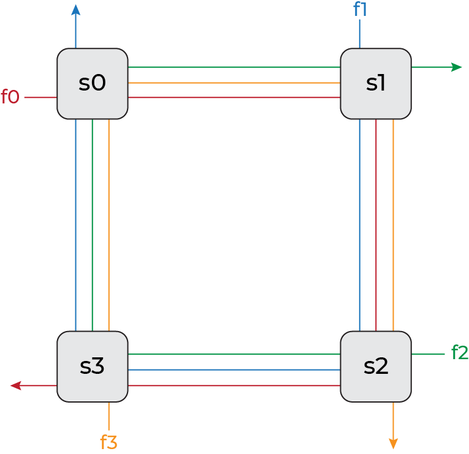
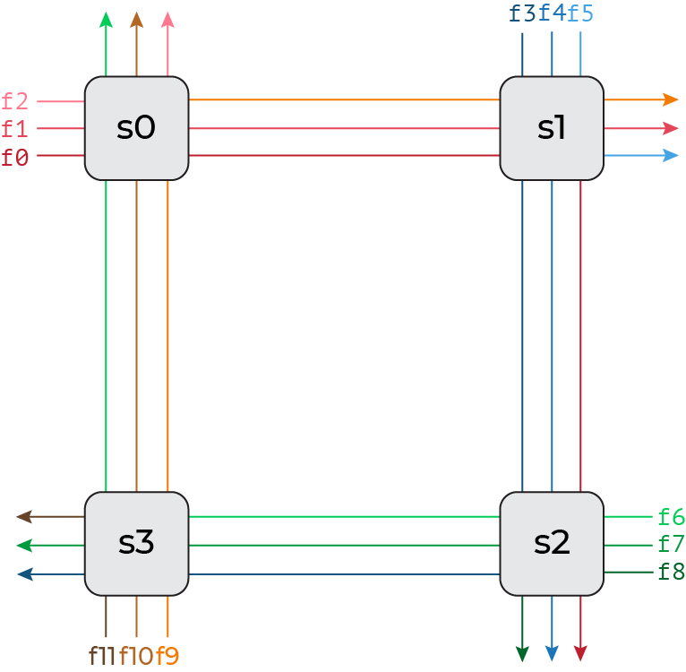

# ECOWCDB: Efficient Computation of Worst-Case Delay-Bounds for Time-Sensitive Networks
Author: Edin Guso

Advisors: Seyed Mohammadhossein Tabatabaee, Stéphan Plassart, Jean-Yves Le Boudec

Institute: Computer Communications and Applications Laboratory 2 (LCA2), École Polytechnique Fédérale de Lausane (EPFL)


# Table of Contents
The readme consists of 2 main parts: Report and Project. Report section includes the project discussion, while the Project section is what one would expect from a regular readme.

- [ECOWCDB](#ecowcdb-efficient-computation-of-worst-case-delay-bounds-for-time-sensitive-networks)
- [Table of Contents](#table-of-contents)
- [Report](#report)
    - [Introduction](#introduction)
    - [Solution](#solution)
        - [Heuristic Algorithm](#heuristic-algorithm)
        - [Results](#results)
        - [Runtime](#runtime)
    - [Skills](#skills)
    - [Major Events](#major-events)
    - [Self-Assesment](#self-assesment)
- [Project](#project)
    - [Introduction](#introduction-1)
    - [Project Structure](#project-structure)
        - [File Description](#file-description)
    - [Installation](#installation)
        - [Requirements](#requirements)
        - [Detailed Guide](#detailed-guide)
    - [How to Use](#how-to-use)
    - [Future Work](#future-work)
    - [References](#references)
- [Contact](#contact)


# Report

## Introduction
Time-Sensitive Networking (TSN) has emerged as a critical technology in various domains where real-time communication is paramount, such as industrial automation, autonomous vehicles, and multimedia streaming. TSN provides deterministic and bounded latency guarantees, ensuring the timely delivery of time-critical data in networked systems. To support the development and deployment of TSN, the TSN Working Group, comprised of industry experts and researchers, has been instrumental in defining standards that address the stringent requirements of these applications.

Time-sensitive networks require performance guarantees under worst-case scenarios, where delays can be maximized due to factors like congestion, contention, and network topology. Unlike average-case analysis, worst-case analysis considers extreme situations to ensure the network's ability to handle critical communication within strict latency bounds. Computing the exact worst-case delays for time-sensitive networks is known to be an NP-hard problem, posing significant computational challenges.

In the quest to analyze and validate the performance of communication networks, Network Calculus has emerged as a powerful mathematical framework. It provides methods for computing upper bounds on worst-case performance parameters, such as end-to-end delay and backlog [[1]](#references). These upper bounds enable network designers to assess the predictability and performance guarantees of their designs and ensure compliance with real-time requirements.

However, computing accurate upper bounds on worst-case performance in time-sensitive networks remains a complex and computationally intensive task. Existing approaches rely on heuristics to overcome the computational intractability of the problem. 
One notable method is the PLP algorithm, proposed in [[2]](#references). The PLP algorithm leverages linear programming techniques to determine worst-case delay bounds.

PLP works by breaking cyclic dependencies within the network and this is achieved by cutting the network. The selection of cuts significantly impacts the accuracy of worst-case delay bounds. Despite the algorithm's effectiveness, selecting suitable cuts for the PLP algorithm poses a significant challenge due to the exponential number of potential cuts for each network.

In the original implementation of the PLP algorithm, the cut selection process follows a simplistic approach. While their approach ensures the construction of a valid forest, the resulting forest heavily relies on the indexing of the nodes (servers) within the network. Even with favorable indexing, this simple cut selection often leads to sub-optimal delay bounds, depending on the network topology.

In summary, our project focuses on addressing the challenges associated with the selection of cuts in the PLP algorithm for accurately estimating worst-case delay bounds. We aim to investigate and understand the intricate relationship between the size, shape, and composition of cuts, and their impact on the resulting delay bounds. By gaining insights into this relationship, we can develop more efficient and accurate heuristics for selecting good cuts for networks of varying sizes and topologies. Through these contributions, we strive to improve the reliability and efficiency of communication systems operating in time-critical environments.

## Solution
In this section, we present our solution to the challenge of selecting good cuts for the PLP algorithm in order to obtain good worst-case delay bounds in time-sensitive networks. Our solution encompasses a heuristic algorithm designed to address this non-trivial problem, aiming to enhance the efficiency and accuracy of performance analysis in such networks.

Leveraging insights gained from an exhaustive search over all possible cuts for a diverse set of network topologies, we designed an algorithm that effectively selects cuts to achieve good worst-case delay bounds. Through meticulous examination of the results and comprehensive statistical analysis, we have made significant observations that form the basis of our heuristic approach.

Our first key observation is that performing smaller cuts tends to yield better delay bounds. This finding suggests that by minimizing the extent of disruptions within the network, we can improve the overall performance in terms of worst-case delays. Consequently, our heuristic algorithm places emphasis on identifying and selecting cuts that have a smaller impact on the network, contributing to more favorable worst-case delay bounds.

Furthermore, our second significant observation indicates that not cutting the flow of interest generally leads to improved delay bounds. By preserving the integrity of the flow of interest, which typically represents the critical communication path, we ensure that the latency guarantees for time-sensitive applications are maintained. This crucial insight guides our heuristic algorithm to prioritize cuts that avoid interrupting the flow of interest, further enhancing the accuracy of worst-case delay bound estimation.

In addition to these main observations, we have also made a supporting observation related to avoiding cuts on flows that overlap with the flow of interest. Our analysis suggests that such overlapping flows should be preserved whenever possible, as cutting them could introduce additional dependencies and potentially compromise the worst-case delay bounds. However, if cutting is necessary to avoid cyclic dependencies, our heuristic algorithm seeks to place the cut after the overlap. If this is not feasible, the cut is positioned towards the start of the flow, farther away from the overlap. While this supporting observation adds complexity, it provides valuable guidance for achieving good delay bounds when selecting cuts.

To evaluate the effectiveness of our heuristic algorithm, we compared its performance with the optimal cut obtained through exhaustive search. The results of our numerical experiments on various generic network topologies reveal that our heuristic algorithm often achieves comparable worst-case delay bounds to the optimal cut. It is important to acknowledge that finding the optimal delay bound is a highly challenging task due to the computational complexity of the problem. As a result, our heuristic algorithm, although effective, may not necessarily guarantee the identification of the absolute optimal cut. The complexity arises from the exponential number of potential cuts for each network and the intricate relationship between cuts and performance. Despite this limitation, our solution represents a significant step forward in addressing this challenging problem and provides practical and effective means to enhance the reliability and efficiency of communication systems operating in time-critical environments.

In the following sections, we will delve into further details of our solution, describing the implementation of the heuristic algorithm and showcasing the numerical results obtained from our experimentation. Through this comprehensive analysis, we aim to establish the robustness and practical applicability of our solution in the realm of time-sensitive networking.

### Heuristic Algorithm
```
Algorithm: Find the flow-preserving min-cut forest

forest <- empty list
node_depth <- empty list
visited <- empty set

for every edge in flow of interest:
    forest.append(edge)

for every node in flow of interest:
    visited.add(node)
    node_depth.append(node, depth)

while node_depth is not empty:
    node, depth <- node with the least depth
    for every neighbour with an edge directed to node:
        if neighbour is not visited:
            visited.add(neighbour)
            node_depth.append(neighbour, depth+1)
            forest.append(edge)

return forest
```

### Results
In this section, we present the numerical results obtained from our experimentation to evaluate the performance of our heuristic algorithm for selecting cuts in the PLP algorithm. We conducted our experiments on a range of generic network topologies, which are shown in the [Network Topologies](#network-topologies) section. These topologies capture various network configurations and characteristics, enabling us to assess the effectiveness and applicability of our solution across different scenarios.

For each network topology, we used the following parameters:
```
Service Rate (Server) = 10Gb/s
Latency (Server) = 10µs
Burst (Flow) = 8Kb
Maximum load (Server) = 50%
```

| Network Topology | Number of Servers | Optimal Delay | Heuristic Delay |
|:-:|:-:|:-:|:-:|
| Semi Ring | 12 | 84.65µs | 84.65µs |
| Full Ring | 12 | 149.13µs | 149.13µs |
| Complete Semi Ring | 11 | 109.17µs | 109.17µs |
| Complete Full Ring | 7 | 139.18µs | 139.27µs |
| Mesh | 9 | 89.25µs | 98.39µs |

The presented results demonstrate the effectiveness of our heuristic algorithm in approximating the optimal delay bounds in different network topologies. While the heuristic delay may not always match the optimal delay, it is often very close and achieves comparable performance.

### Runtime


\
\
\
\
\
\
\
.


## Contribution
Our project makes several significant contributions to the field of Network Calculus in FIFO networks. Firstly, we developed a solution that simplifies the generation of common network topologies, saving time and reducing the likelihood of errors. Secondly, we introduced an `Analysis` class that allows users to analyze the effects of cuts on delay and runtime. Additionally, we created a `Stats` class to compute correlation statistics based on the analysis results. These insights were then utilized to design a heuristic algorithm, implemented in the `ECOWCDB` class. The details of our contributions can be found in the following sections.

### Solution
Our solution can be divided into 4 main parts:

1. **Network Generation:** We simplified the generation of common network topologies such as Tandem (interleaved, source-sink, sink-tree), Mesh, and Ring (full, semi, complete-full, complete-semi) networks. Instead of defining arrival curves and paths for each flow, and service curves and shapers for each server, the users can call a single function and pass a few parameters (rate, latency, burst, number of servers, and maximum load) to generate these common network topologies. This saves time as well as avoiding typos that can happen when defining all servers and flows individually.

2. **Cut Analysis:** We created an `Analysis` class which is used to analyze the effects of cuts on the delay and runtime. The user can compute a delay for any cut, perform exhaustive search on all the valid cuts, and perform partial search on a random subset of valid cuts.    

    Exhaustive search provides more information; however, it is infeasible to perform exhaustive search on medium to large size networks as the number of valid cuts increases exponentially in the number of connections (edges) between servers. Partial search is therefore a valuable tool which can be used to get some ideas about the cut behavior in large networks.

    Additionally, the `Analysis` class provides several helpful functions used to display, save and load the obtained results. User can also pick the unit of time in which the results should be displayed, a timeout value which limits the time spent solving an individual linear program, and several verbosity options which indicate how much or how little feedback will the user receive regarding the progress/errors/details of computations.

3. **Cut Statistics:** We created a relatively smaller `Stats` class which is used to compute correlation statistics regarding the results obtained in the Analysis class. This class takes the output of the Analysis class as its input, and can compute the correlation for delay vs. runtime, forest-size vs. delay, and forest-size vs. runtime.

    The results obtained in this class were used in designing our heuristic algorithm which is explained next. Additionally, we use this class to compare how the heuristic algorithm performs relative to all the valid cuts.

4. **Heuristic Algorithm:** Using all the observations from the `Analysis` and `Stats` classes, we created the `ECOWCDB` class. We designed a heuristic algorithm which attempts to generate the most optimal cut (forest) based on the input restrictions such as max-depth and connectedness.

    The user can use one of three defined delay functions: best-delay, delay, and quick-delay. Depending on the function called, the heuristic algorithm will generate an appropriate cut (forest) and compute the delay for the given network and cut.

    As observed in the analysis part of the project, not every network topology has the same behavior when it comes to cuts. Therefore, the generic heuristic algorithm does not always provide the best result. Nevertheless, it can be observed in the next section that the algorithm provides satisfying results for most topologies.

### Achievments
We designed four tools described in [Solution](#solution). This project, including the modifications done to the existing codebase as well as the ECOWCDB library, exceeds 2500 lines of code, out of which ~500 lines are high value code.

Our first main contribution is providing a tool for in-depth analysis of the trade-off between accuracy and tractability of Network Calculus in FIFO networks. The second main contribution is the heuristic algorithm. Results obtained with the heuristic algorithm can be seen in [Results](#results).

### Results
In this section, we will display the quality of the cuts obtained by our heuristic algorithm. We will do so by comparing the results obtained by the heuristic algorithm to the results obtained during exhaustive search in the analysis part.


*Table: First column of the table represents the network topology examined. Second column is the number of servers within the network. Third column is the max depth parameter used for generating the forests in delay and quick delay functions. Fourth delay displays which heuristic was used for generating the forest. Fifth column displays in which percentile the delay is placed compared to all the delays of all the cuts computed during the exhaustive search. Sixth column displays how higher or lower the runtime is compared to the median runtime of all the cuts computed during exhaustive search.*

### Discussion
*Based on the resutls above...*

## Skills
Skills that I have exercised throughout the project:
- **Research:**  I utilized research skills to explore the field of Network Calculus in FIFO networks. I identified existing challenges and gaps in the literature and used that knowledge to develop innovative solutions and contributions.
- **Software Engineering:** I employed software engineering skills to design, develop, and maintain a comprehensive solution. This involved writing code, organizing the project structure, and implementing various modules and classes. I followed software engineering best practices to ensure the codebase's scalability, maintainability, and robustness.
- **Graph Theory:** Graph theory played a crucial role in this project, specifically in the analysis of network topologies and cuts. I applied graph theory concepts to model and represent the network structures, connections between servers, and paths of flows. By leveraging graph theory algorithms and techniques, I was able to analyze the effects of cuts on delay and runtime.
- **Algorithm Design:** Algorithm design was a fundamental skill demonstrated in this project. I formulated and implemented algorithms for various tasks, such as generating network topologies, performing cut analysis, and designing the heuristic algorithm. I leveraged algorithmic techniques to efficiently solve complex problems and make informed decisions based on the analysis results.
- **Version Control:** I utilized version control throughout the project. Version control skills involve using tools like Git to manage changes to the codebase, track different versions of the project, and ensure proper code organization and documentation. This skill helps maintain a coherent and organized code history and facilitates collaboration and integration of contributions of future collaborators.

Skills I had to acquire for the project:
- **Understanding the Basics of Network Calculus:** In order to contribute effectively to the project, I needed to acquire a solid understanding of the fundamentals of network calculus. I immersed myself in studying the key concepts, principles, and mathematical models used in network calculus. This included comprehending the concepts of arrival curves, service curves, and their relationship in analyzing the performance of network systems. By learning about the foundations of network calculus, I was able to apply this knowledge to design and implement accurate and efficient algorithms within the project.
- **Project Setup and Extension with GitHub:** One of the skills I had to acquire was the ability to clone an existing GitHub project and set it up on my local machine. Additionally, I learned how to run the project and configure any required dependencies. Furthermore, I acquired the skills to extend and modify the existing project to incorporate my contributions effectively.
- **Advanced Knowledge of Graph Theory, Flow Networks, and Cuts:** To make significant contributions to the project, I dedicated time to expand my knowledge of graph theory, with a specific focus on flow networks and cuts. I delved deeper into the theory and algorithms related to directed graphs, understanding how flows can be modeled and represented. Moreover, I acquired the skills to cut a directed graph into a forest, which involves partitioning the graph into subgraphs without any cycles. I explored various algorithms and techniques to obtain the set of all possible forests given a directed graph. By mastering these concepts, I was able to develop efficient algorithms and implement the necessary functionalities to analyze cuts within the project.
- **Documentation:** To ensure the clarity and comprehensibility of the project, I developed skills in documentation. This involved creating detailed and organized documentation for various components, algorithms, and functionalities within the project. By honing these skills, I contributed to the overall usability and maintainability of the project, facilitating its future development and understanding.

## Major Events
*Report on the major events of the project, including unexpected difficulties.*

## Self-Assesment
*Provide a self-assessment (where did you succeed most, where did you fail)*


# Project

## Introduction
This project is an extension of the panco project [[3]](#references). *A bit more introduction.*

## Project Structure
    .
    └- README.md
    └- installation.md
    └- LICENSE
    └- ecowcdb/
    |   └- __init__.py
    |   └- analysis.py
    |   └- ecowcdb.py
    |   └- networks.py
    |   └- options.py
    |   └- stats.py
    |   └- util/
    |   |   └- __init__.py
    |   |   └- errors.py
    |   |   └- network.py
    |   |   └- units.py
    |   |   └- validation.py
    |   └- panco/
    |       └- __init__.py
    |       └- lp_solve
    |       └- lpSolvePath.py
    |       └- ...
    └- example/
    |   └- README.md
    |   └- ...
    └- results/
    |   └- README.md
    |   └- ...
    └- temp/
        └- README.md

### File Description
- [`README.md`](https://github.com/EdinGuso/ecowcdb/blob/main/README.md): This `README`.
- [`installation.md`](https://github.com/EdinGuso/ecowcdb/blob/main/installation.md): In-depth installation guide.
- [`LICENSE`](https://github.com/EdinGuso/ecowcdb/blob/main/LICENSE): License of this project.
- [`ecowcdb/`](https://github.com/EdinGuso/ecowcdb/blob/main/ecowcdb/)
    - [`analysis.py`](https://github.com/EdinGuso/ecowcdb/blob/main/ecowcdb/analysis.py): Contains the analysis tool.
    - [`ecowcdb.py`](https://github.com/EdinGuso/ecowcdb/blob/main/ecowcdb/ecowcdb.py): Access the heuristic algorithm.
    - [`networks.py`](https://github.com/EdinGuso/ecowcdb/blob/main/ecowcdb/networks.py): Contains the network generation tool.
    - [`options.py`](https://github.com/EdinGuso/ecowcdb/blob/main/ecowcdb/options.py): Contains all the option enums. These are used as types of constructor arguments in other tools.
    - [`stats.py`](https://github.com/EdinGuso/ecowcdb/blob/main/ecowcdb/stats.py): Contains the statistical analysis tool.
    - [`util/`](https://github.com/EdinGuso/ecowcdb/blob/main/ecowcdb/util/)
        - [`errors.py`](https://github.com/EdinGuso/ecowcdb/blob/main/ecowcdb/util/errors.py): Contains the custom error class and its utility functions. Used to catch and communicate lp_solve related errors.
        - [`network.py`](https://github.com/EdinGuso/ecowcdb/blob/main/ecowcdb/util/network.py): Contains the network and graph related utility functions.
        - [`units.py`](https://github.com/EdinGuso/ecowcdb/blob/main/ecowcdb/util/units.py): Contains the unit related utility functions. Streamlines displaying results in different units.
        - [`validation.py`](https://github.com/EdinGuso/ecowcdb/blob/main/ecowcdb/util/validation.py): Contains the validation tool. This tool strict user input validation to ensure a controlled environment within other classes.
    - [`panco/`](https://github.com/EdinGuso/ecowcdb/blob/main/ecowcdb/panco/)
        - [`lpsolve`](https://github.com/EdinGuso/ecowcdb/blob/main/ecowcdb/panco/lpsolve): The `lp_solve` executable.
        - [`lpSolvePath.py`](https://github.com/EdinGuso/ecowcdb/blob/main/ecowcdb/panco/lpSolvePath.py): You need to change `LPSOLVEPATH` in this file if you change the location of `lpsolve`.
- [`example/`](https://github.com/EdinGuso/ecowcdb/blob/main/example/)
    - [`README.md`](https://github.com/EdinGuso/ecowcdb/blob/main/example/README.md): Explains the purpose and usage of the `example` folder.
- [`results/`](https://github.com/EdinGuso/ecowcdb/blob/main/results/)
    - [`README.md`](https://github.com/EdinGuso/ecowcdb/blob/main/results/README.md): Explains the purpose and usage of the `results` folder.
- [`temp/`](https://github.com/EdinGuso/ecowcdb/blob/main/temp/)
    - [`README.md`](https://github.com/EdinGuso/ecowcdb/blob/main/temp/README.md): Explains the purpose and usage of the `temp` folder.

## Installation
Please install the [Requirements](#requirements).

Quickly build the project using `setup.py` by running the following command at the root of the project:

```
pip install .
```

### Requirements
- `Python>=3.10`
    - `numpy`
    - `scipy`
    - `tqdm`
    - `tabulate`
- `lp_solve==5.5.2.11`: Download and install from [`lpsolve`](https://sourceforge.net/projects/lpsolve/). The [`lp_solve`](https://github.com/EdinGuso/ecowcdb/blob/main/ecowcdb/panco/lpsolve) in this project was built on `Ubuntu 22.04.2 LTS`.

### Detailed Guide
Please follow the detailed [installation guide](https://github.com/EdinGuso/ecowcdb/blob/main/installation.md) if any issues arise during installation.

## How to Use
*how to use...*

#### Network Topologies




## Future Work
*future work...*


# References
[1] Boudec, J.-Y. L. and Thiran, P. (2001). Network calculus: A theory of deterministic queuing systems for the internet. Springer. 

[2] Bouillard, A. (2022). Trade-off between accuracy and Tractability of network calculus in FIFO networks. Performance Evaluation, 153, 102250. https://doi.org/10.1016/j.peva.2021.102250 

[3] https://github.com/Huawei-Paris-Research-Center/panco


# Contact
Regarding any question/problem about this project, please contact me via e-mail:
- [Academic](mailto:edin.guso@epfl.ch)
- [Primary](mailto:edinguso@gmail.com)
- [Secondary](mailto:edinguso@hotmail.com)
