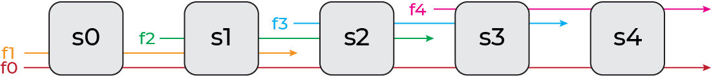

# ECOWCDB: Efficient Computation of Worst-Case Delay-Bounds for Time-Sensitive Networks
Author: Edin Guso

Advisors: Seyed Mohammadhossein Tabatabaee, Stéphan Plassart, Jean-Yves Le Boudec

Institute: Computer Communications and Applications Laboratory 2 (LCA2), École Polytechnique Fédérale de Lausane (EPFL)


# Table of Contents
The readme consists of 2 main parts: Report and Project. Report section includes the project discussion, while the Project section is what one would expect from a regular readme.

- [ECOWCDB](#ecowcdb-efficient-computation-of-worst-case-delay-bounds-for-time-sensitive-networks)
- [Table of Contents](#table-of-contents)
- [Report](#report)
    - [Introduction](#introduction)
    - [Solution](#solution)
        - [Algorithm A: Min-Cut Forest](#algorithm-a-min-cut-forest)
            - [Results](#results)
        - [Runtime](#runtime)
        - [Algorithm B: Min-Cut Forest with Restricted Depth](#algorithm-b-min-cut-forest-with-restricted-depth)
            - [Results](#results-1)
        - [Algorithm C: Min-Cut Tree with Restricted Depth](#algorithm-c-min-cut-tree-with-restricted-depth)
            - [Results](#results-2)
        - [Results and Discussion](#results-and-discussion)
            - [Network Specifications](#network-specifications)
            - [System Specifications](#system-specifications)
            - [Small-Medium Networks](#small-medium-networks)
            - [Medium-Large Networks](#medium-large-networks)
        - [Contributions](#contributions)
            - [Network Generation](#network-generation)
            - [Cut Analysis](#cut-analysis)
            - [Cut Statistics](#cut-statistics)
            - [Heuristic Algorithm](#heuristic-algorithm)
    - [Achievements](#achievements)
    - [Skills](#skills)
    - [Major Events](#major-events)
    - [Self-Assesment](#self-assesment)
- [Project](#project)
    - [Introduction](#introduction-1)
    - [Project Structure](#project-structure)
        - [File Description](#file-description)
    - [Installation](#installation)
        - [Manual](#manual)
            - [Requirements](#requirements)
        - [Virtual Machine](#virtual-machine)
    - [How to Use](#how-to-use)
        - [Options](#options)
        - [Networks](#networks)
            - [Network Topologies](#network-topologies)
        - [Analysis](#analysis)
        - [Stats](#stats)
        - [ECOWCDB](#ecowcdb)
- [References](#references)
- [Contact](#contact)


# Report

## Introduction
Time-sensitive networks, as in the context of IEEE Time-Sensitive Networking (TSN) and IETF Deterministic Networking (DetNet), require bounds on the worst-case delays as they support safety-critical applications and offer deterministic services with guaranteed, bounded latency. Finding the exact worst-case delays is known to be an NP-hard problem; hence we are interested in bounds on the worst-case delays.

In the quest to analyze and validate the performance of communication networks, Network Calculus has emerged as a powerful mathematical framework. It provides methods for computing upper bounds on worst-case performance parameters, such as end-to-end delay and backlog [[1]](#references). These upper bounds enable network designers to assess the predictability and performance guarantees of their designs and ensure compliance with real-time requirements.

However, computing accurate upper bounds on worst-case performance in time-sensitive networks remains a complex and computationally intensive task. Existing approaches rely on heuristics to overcome the computational intractability of the problem. 
One notable method is the PLP algorithm, proposed in [[2]](#references). The PLP algorithm leverages linear programming techniques to determine worst-case delay bounds.

PLP works by breaking cyclic dependencies within the network and this is achieved by cutting the network. The selection of cuts significantly impacts the accuracy of worst-case delay bounds. Despite the algorithm's effectiveness, selecting suitable cuts for the PLP algorithm poses a significant challenge due to the exponential number of potential cuts for each network.

In the original implementation of the PLP algorithm, the cut selection process follows a simplistic approach. While their approach ensures the construction of a valid forest, the resulting forest heavily relies on the indexing of the nodes (servers) within the network. Even with favorable indexing, this simple cut selection often leads to sub-optimal delay bounds, depending on the network topology.

In summary, our project focuses on addressing the challenges associated with the selection of cuts in the PLP algorithm for accurately estimating worst-case delay bounds. We aim to investigate and understand the intricate relationship between the size, shape, and composition of cuts, and their impact on the resulting delay bounds. By gaining insights into this relationship, we can develop more efficient and accurate heuristics for selecting good cuts for networks of varying sizes and topologies. Through these contributions, we strive to improve the reliability and efficiency of communication systems operating in time-critical environments.

## Solution
In this section, we present our solution to the challenge of selecting good cuts for the PLP algorithm in order to obtain good worst-case delay bounds in time-sensitive networks. Our solution encompasses a heuristic algorithm designed to address this non-trivial problem, aiming to enhance the efficiency and accuracy of performance analysis in such networks.

Leveraging insights gained from an exhaustive search over all possible cuts for a diverse set of network topologies, we designed an algorithm that effectively selects cuts to achieve good worst-case delay bounds. Through meticulous examination of the results and comprehensive statistical analysis, we have made significant observations that form the basis of our heuristic approach.

Our first key observation is that performing smaller cuts tends to yield better delay bounds. This finding suggests that by minimizing the extent of disruptions within the network, we can improve the overall performance in terms of worst-case delays. Consequently, our heuristic algorithm places emphasis on identifying and selecting cuts that have a smaller impact on the network, contributing to more favorable worst-case delay bounds.

Furthermore, our second significant observation indicates that not cutting the flow of interest generally leads to improved delay bounds. By preserving the integrity of the flow of interest, which typically represents the critical communication path, we ensure that the latency guarantees for time-sensitive applications are maintained. This crucial insight guides our heuristic algorithm to prioritize cuts that avoid interrupting the flow of interest, further enhancing the accuracy of worst-case delay bound estimation.

In addition to these main observations, we have also made a supporting observation related to avoiding cuts on flows that overlap with the flow of interest. Our analysis suggests that such overlapping flows should be preserved whenever possible, as cutting them could introduce additional dependencies and potentially compromise the worst-case delay bounds. However, if cutting is necessary to avoid cyclic dependencies, our heuristic algorithm seeks to place the cut after the overlap. If this is not feasible, the cut is positioned towards the start of the flow, farther away from the overlap. While this supporting observation adds complexity, it provides valuable guidance for achieving good delay bounds when selecting cuts.

To evaluate the effectiveness of our heuristic algorithm, we compared its performance with the optimal cut obtained through exhaustive search. The results of our numerical experiments on various generic network topologies reveal that our heuristic algorithm often achieves comparable worst-case delay bounds to the optimal cut. It is important to acknowledge that finding the optimal delay bound is a highly challenging task due to the computational complexity of the problem. As a result, our heuristic algorithm, although effective, may not necessarily guarantee the identification of the absolute optimal cut. The complexity arises from the exponential number of potential cuts for each network and the intricate relationship between cuts and performance. Despite this limitation, our solution represents a significant step forward in addressing this challenging problem and provides practical and effective means to enhance the reliability and efficiency of communication systems operating in time-critical environments.

In the following sections, we will delve into further details of our solution, describing the implementation of the heuristic algorithm and showcasing the numerical results obtained from our experimentation. Through this comprehensive analysis, we aim to establish the robustness and practical applicability of our solution in the realm of time-sensitive networking.

### Algorithm A: Min-Cut Forest
```
forest <- []
node_depth <- []
visited <- {}

node <- last node in foi
visited.add(node)
node_depth.append(node, 0)
for every edge=(node1,node2) in reverse(foi):
    visited.add(node1)
    node_depth.append(node1, node2.depth+1)
    forest.append(edge)

while node_depth is not empty:
    node, depth <- node with the smallest depth
    for every neighbour with an edge directed to node:
        if neighbour is not visited:
            visited.add(neighbour)
            node_depth.append(neighbour, node.depth+1)
            forest.append(edge)

return forest
```

#### Results
In this section, we present the numerical results obtained from our experimentation to evaluate the performance of our heuristic algorithm for selecting cuts in the PLP algorithm. We conducted our experiments on a range of generic network topologies, which are shown in the [Network Topologies](#network-topologies) section. These topologies capture various network configurations and characteristics, enabling us to assess the effectiveness and applicability of our solution across different scenarios.

For each network topology, we used the following parameters:
```
Service Rate (Server) = 10Gb/s
Latency (Server) = 10µs
Burst (Flow) = 8Kb
Maximum load (Server) = 50%
```

| Network Topology | Number of Servers | Exhaustive Search | Algorithm A |
|:-:|:-:|:-:|:-:|
| Semi Ring | 12 | 84.65µs | 84.65µs |
| Full Ring | 12 | 149.13µs | 149.13µs |
| Complete Semi Ring | 11 | 109.17µs | 109.17µs |
| Complete Full Ring | 7 | 139.18µs | 139.27µs |
| Mesh | 9 | 89.25µs | 98.39µs |

The results presented in this study provide compelling evidence of the effectiveness of our heuristic algorithm in approximating optimal delay bounds across diverse network topologies. While the heuristic delay may not always precisely match the optimal delay, it consistently achieves a remarkably close approximation and delivers comparable performance. Moreover, upon closer examination in the dedicated [Results and Discussion](#results-and-discussion), we delve deeper into the performance of our algorithm in mesh networks, which initially appeared to pose a significant challenge. However, our thorough analysis reveals that the algorithm exhibits remarkable strength, particularly in larger mesh networks. This comprehensive investigation not only underscores the inherent robustness of our algorithm but also highlights its exceptional performance in overcoming the complexities inherent in a wide range of network topologies.

### Runtime
The runtime of the PLP algorithm plays a crucial role in its practical applicability. In this subsection, we discuss the runtime considerations and tractability of the algorithm, highlighting the trade-off between the quality of obtained delay bounds and the computational efficiency.

During our exhaustive search over all possible cuts, we observed an interesting relationship between the size of the cut and the runtime. It became evident that smaller cuts generally resulted in longer runtime. This observation inherently introduces a trade-off between the quality of worst-case delay bounds and the computational efficiency of the PLP algorithm.

To understand the reason behind this trade-off, we delve into the inner workings of the PLP algorithm. When more cuts are introduced, the PLP algorithm solves a larger number of smaller linear programs instead of solving fewer, larger linear programs. By cutting the network, we essentially create multiple smaller networks. The reduced runtime is observed due to the fact that the number of constraints and variables in the linear programs is polynomial in the size of the network. However, it is important to note that the PLP algorithm still needs to solve one large linear program to compute the bursts of newly generated flows resulting from the cuts. Therefore, while introducing more cuts can decrease the runtime of the PLP algorithm for larger networks, the runtime may be unchanged or even become worse for smaller networks.

Additionally, the cutting of the network is not only valuable for networks with cyclic dependencies but also for networks which are originally trees, such as tandem networks. Although tandem networks do not exhibit cyclic dependencies, they can still benefit from the decreased runtime achieved by cutting the networks into smaller components. Therefore, in this section, we examine both Tandem networks alongside Ring and Mesh networks to assess the performance trade-offs.

Upon realizing the significant increase in runtime for minimal cuts in large networks, we developed two new algorithms, namely Algorithm B: Min-Cut Forest with Restricted Depth and Algorithm C: Min-Cut Tree with Restricted Depth, to mitigate this issue and strike a balance between delay bounds and computational efficiency.

Algorithm B introduces a maximum depth parameter and cuts the network into smaller trees after reaching this depth. While this approach usually reduces the quality of the delay bounds obtained, it greatly improves the performance of the algorithm. By limiting the depth of the network, Algorithm B ensures that the PLP algorithm solves smaller linear programs, leading to shorter runtimes. The trade-off, however, is that the resulting delay bounds may be slightly looser compared to the optimal cut obtained through exhaustive search.

Building on Algorithm B, we developed Algorithm C, which also incorporates a maximum depth parameter. However, once the maximum depth is reached, Algorithm C does not add any additional edges and outputs a single tree. This approach outperforms Algorithm B in scenarios where the depth of the flow of interest is much smaller than the depth of the network itself. By reducing the number of trees, Algorithm C achieves improved runtime without cutting the flow of interest.

Through these algorithmic enhancements, we aim to strike a balance between the quality of worst-case delay bounds and the computational efficiency of the PLP algorithm. By leveraging these modified algorithms, we can address the runtime challenges associated with large network topologies, enhancing the feasibility of worst case delay bound computation for time-sensitive networking environments.

In the following sections, we will delve into further details of Algorithm B and Algorithm C, describing their implementation and providing a comparative analysis of their performance in terms of runtime and delay bounds. By examining the practical implications of these algorithms, we aim to provide valuable insights into the trade-offs involved in selecting cuts for worst-case delay analysis.

### Algorithm B: Min-Cut Forest with Restricted Depth
```
forest <- []
node_depth <- []
visited <- {}

node <- last node in foi
visited.add(node)
node_depth.append(node, 0)
for every edge=(node1,node2) in reverse(foi):
    visited.add(node1)
    if node2.depth == maximum depth:
        node_depth.append(node1, 0)
    else:
        node_depth.append(node1, node2.depth+1)
        forest.append(edge)

while node_depth is not empty:
    node, depth <- node with the smallest depth
    for every neighbour with an edge directed to node:
        if neighbour is not visited:
            visited.add(neighbour)
            if node2.depth == maximum depth:
                node_depth.append(neighbour, 0)
            else:
                node_depth.append(neighbour, node.depth+1)
                forest.append(edge)

return forest
```

#### Results
In this section, we present the numerical results obtained from our experimentation to evaluate the performance of Algorithm B, a modified version of our heuristic algorithm for selecting cuts in the PLP algorithm. Algorithm B introduces a maximum depth parameter and cuts the network into smaller trees after reaching this depth, striking a balance between delay bounds and computational efficiency. While Algorithm B generally performs slightly worse than Algorithm A in terms of delay bounds, the significant runtime improvements it offers make it a valuable tool, particularly for larger networks. The runtime benefits achieved by Algorithm B will be examined in greater detail in the [Results and Discussion](#results-and-discussion) section. Our experiments were conducted on a range of generic network topologies, which are shown in the [Network Topologies](#network-topologies) section. These topologies encompass diverse network configurations, enabling us to assess the effectiveness and applicability of Algorithm B across different scenarios.

For each network topology, we used the following parameters:
```
Service Rate (Server) = 10Gb/s
Latency (Server) = 10µs
Burst (Flow) = 8Kb
Maximum load (Server) = 50%
```

| Network Topology | Number of Servers | Max Depth | Exhaustive Search | Algorithm B |
|:-:|:-:|:-:|:-:|:-:|
| Semi Ring | 12 | 5 | 84.65µs | 87.44µs |
| Full Ring | 12 | 5 | 149.13µs | 154.94µs |
| Complete Semi Ring | 11 |  4 | 109.17µs | 111.71µs |
| Complete Full Ring | 7 |  3 | 139.18µs | 142.19µs |
| Mesh | 9 | 2 | 89.25µs | 94.30µs |
| Sink-tree Tandem | 12 | 5 | 133.01µs | 136.19µs |
| Interleaved Tandem | 12 | 5 | 145.92µs | 145.92µs |
| Source-sink Tandem | 12 | 5 | 147.05µs | 151.77µs |

### Algorithm C: Min-Cut Tree with Restricted Depth
```
tree <- []
node_depth <- []
visited <- {}

node <- last node in foi
visited.add(node)
node_depth.append(node, 0)
for every edge=(node1,node2) in reverse(foi):
    visited.add(node1)
    if node2.depth == maximum depth:
        break
    else:
        node_depth.append(node1, node2.depth+1)
        tree.append(edge)

while node_depth is not empty:
    node, depth <- node with the smallest depth
    for every neighbour with an edge directed to node:
        if neighbour is not visited:
            visited.add(neighbour)
            if node.depth == maximum depth:
                break
            else:
                node_depth.append(neighbour, node.depth+1)
                tree.append(edge)

return tree
```

#### Results
In this section, we present the numerical results obtained from our experimentation to evaluate the performance of Algorithm C, another variant of our heuristic algorithm for selecting cuts in the PLP algorithm. Algorithm C incorporates a maximum depth parameter and, after reaching the maximum depth, outputs a single small tree without adding additional edges. While Algorithm C typically performs worse than Algorithm B and exhibits a less favorable delay-runtime trade-off, it remains a valuable algorithm for large networks where the depth of the flow of interest is considerably smaller than the depth of the network itself. The runtime benefits achieved by Algorithm C will be examined in greater detail in the [Results and Discussion](#results-and-discussion) section. Our experiments were conducted on a range of generic network topologies, which are shown in the [Network Topologies](#network-topologies) section. These topologies represent various network configurations, allowing us to assess the effectiveness and applicability of Algorithm C in different scenarios.

For each network topology, we used the following parameters:
```
Service Rate (Server) = 10Gb/s
Latency (Server) = 10µs
Burst (Flow) = 8Kb
Maximum load (Server) = 50%
```

| Network Topology | Number of Servers | Max Depth | Exhaustive Search | Algorithm C |
|:-:|:-:|:-:|:-:|:-:|
| Semi Ring | 12 | 5 | 84.65µs | 88.57µs |
| Full Ring | 12 | 5 | 149.13µs | 164.56µs |
| Complete Semi Ring | 11 |  4 | 109.17µs | 113.95µs |
| Complete Full Ring | 7 |  3 | 139.18µs | 151.15µs |
| Mesh | 9 | 2 | 89.25µs | 100.60µs |
| Sink-tree Tandem | 12 | 5 | 133.01µs | 137.01µs |
| Interleaved Tandem | 12 | 5 | 145.92µs | 153.64µs |
| Source-sink Tandem | 12 | 5 | 147.05µs | 159.89µs |

### Results and Discussion
Now, we present an extensive evaluation of the performance-runtime trade-off in computing delay bounds. We compare the effectiveness of three heuristic algorithms (Algorithm A, Algorithm B, and Algorithm C) with the best results obtained through exhaustive or partial search methods, depending on the size of the network.

To ensure a comprehensive analysis, we separately evaluate each network topology type, taking into account the unique characteristics and complexities associated with different network structures. Furthermore, investigating different network sizes within each topology type allows us to assess how algorithmic efficiency scales with network complexity.

By considering the performance-runtime trade-off, and the impact of network topology and size, we can derive meaningful insights regarding the suitability of the heuristic algorithms for practical applications. These insights guide informed decision-making when selecting algorithms, accounting for both computational efficiency and the accuracy of the computed delay bounds.

#### Network Specifications
Our experiments were conducted on a range of generic network topologies, which are shown in the [Network Topologies](#network-topologies) section. For each network topology, we used the following parameters:
```
Service Rate (Server) = 10Gb/s
Latency (Server) = 10µs
Burst (Flow) = 8Kb
Maximum load (Server) = 50%
```

#### System Specifications
In addition to network factors, it is crucial to consider the system specifications that influence runtime. In this project, the program was executed on a virtual machine hosted on a Dell XPS 15 9510 laptop (including an 11th Gen Intel(R) Core(TM) i9-11900H processor with 8 cores and 16 logical processors, 32GB of RAM, and an NVIDIA GeForce RTX 3050 Ti Laptop GPU). The virtual machine runs Ubuntu 22.04.2 LTS and is equipped with 8GB of dedicated RAM. The virtual machine also utilizes 4 processors to handle the computational workload effectively.

#### Small-Medium Networks
In this subsection, we focus on analyzing small to medium-sized networks. These networks offer the advantage of tractability, allowing us to apply exhaustive search methods for comparison. Although all algorithms, including exhaustive search, demonstrate manageable runtimes for these smaller networks, we perform this analysis to compare the performance of our algorithms with the best possible results. While the upcoming section will provide more meaningful insights into runtime performance, it will not allow us to determine the best possible result for comparison.

- **Semi Ring Network (12 Servers, 12 Flows)**
    | Method | Max Depth | Runtime | Delay Bound (▾) |
    |:-:|:-:|:-:|:-:|
    | Exhaustive Search | - | 14m 22s | 84.65µs |
    | Algorithm A | - | 7.41s | 84.65µs |
    | Algorithm B | 6 | 2.86s | 85.99µs |
    | Algorithm C | 6 | 1.76s | 86.57µs |
    | Algorithm B | 4 | 1.70s | 88.16µs |
    | Algorithm C | 4 | 1.08s | 90.73µs |

    Algorithm A demonstrated its capability by successfully identifying the optimal cut, achieving the best possible result. This highlights the effectiveness of Algorithm A in this network topology. 

    Moving on, Algorithm B with a maximum depth of 6 showed promising results, producing a solution that was close to optimal while significantly reducing the runtime compared to Algorithm A. This indicates that Algorithm B strikes a good balance between accuracy and efficiency in this network.

    Next, we compared Algorithm B with a maximum depth of 4 to Algorithm C with a maximum depth of 6. Surprisingly, Algorithm C outperformed Algorithm B in terms of delay bound even though their runtimes were comparable. This showcases its strength in networks where the depth of the flow of interest is less than the overall depth of the network. 

    Lastly, when Algorithm C was executed with a maximum depth of 4, it exhibited a remarkably quick runtime. However, this came at the cost of a significantly worse delay bound. This trade-off highlights the importance of striking a balance between runtime and the quality of the delay bound when choosing the appropriate algorithm for a specific network scenario.

- **Full Ring Network (12 Servers, 12 Flows)**
    | Method | Max Depth | Runtime | Delay Bound (▾) |
    |:-:|:-:|:-:|:-:|
    | Exhaustive Search | - | 7h 31m 41s | 149.13µs |
    | Algorithm A | - | 51.98s | 149.13µs |
    | Algorithm B | 6 | 16.02s | 154.85µs |
    | Algorithm B | 4 | 10.96s | 159.15µs |
    | Algorithm C | 6 | 11.25s | 161.91µs |
    | Algorithm C | 4 | 5.87s | 167.16µs |

    Algorithm A once again demonstrated its capability by successfully identifying the optimal cut, achieving the best possible result. This highlights Algorithm A's effectiveness in this network topology.

    Moving on, Algorithm B with a maximum depth of 6 achieved a result that was considered mediocre, falling short of the optimal cut. However, it showcased a significant reduction in runtime compared to Algorithm A. This indicates that Algorithm B offers a trade-off between accuracy and efficiency, making it a viable option in scenarios where runtime is a critical factor.

    On the other hand, Algorithm C with a maximum depth of 6 did not perform as well as Algorithm B with a maximum depth of 4 in terms of both delay and runtime. This reveals the shortcomings of Algorithm C in the context of the networks where the flow of interest goes through a large portion of the network.

- **Complete Semi Ring Network (11 Servers, 66 Flows)**
    | Method | Max Depth | Runtime | Delay Bound (▾) |
    |:-:|:-:|:-:|:-:|
    | Exhaustive Search | - | 15h 11m 48s | 109.17µs |
    | Algorithm A | - | 3m 27s | 109.17µs |
    | Algorithm B | 6 | 1m 10s | 109.65µs |
    | Algorithm C | 6 | 53.46s | 110.11µs |
    | Algorithm B | 4 | 49.08s | 111.71µs |
    | Algorithm C | 4 | 25.78s | 113.95µs |

    Once again, Algorithm A showcased its effectiveness by successfully identifying the optimal cut, achieving the best possible result.

    Furthermore, Algorithm B with a maximum depth of 6 demonstrated a commendable performance, achieving a result that was relatively close to the optimal cut while significantly reducing the runtime compared to Algorithm A. This highlights Algorithm B as a promising choice when considering a balance between accuracy and efficiency in networks with complete semi ring topologies.

    Algorithm C with a maximum depth of 6 outperformed Algorithm B with a maximum depth of 4, showcasing its strength in networks where the depth of the flow of interest is less than the depth of the network. Despite a slight increase in runtime, Algorithm C achieved a better delay bound, indicating its capability to effectively analyze cuts in such network configurations.

    Lastly, Algorithm C with a maximum depth of 4 exhibited a quick runtime, but it fell short in terms of the delay bound achieved. While it may be suitable for scenarios where runtime is a critical factor, its compromise in terms of accuracy should be considered when making algorithm selections for similar network topologies.

- **Complete Full Ring Network (7 Servers, 49 Flows)**
    | Method | Max Depth | Runtime | Delay Bound (▾) |
    |:-:|:-:|:-:|:-:|
    | Exhaustive Search | - | 1h 18m 7s | 139.18µs |
    | Algorithm A | - | 2m 4s | 139.27µs |
    | Algorithm B | 4 | 56.24s | 142.63µs |
    | Algorithm C | 4 | 50.84s | 146.65µs |
    | Algorithm B | 2 | 31.82s | 146.99µs |
    | Algorithm C | 2 | 20.82s | 156.12µs |

    Algorithm A once again demonstrated its effectiveness by achieving a result that was extremely close to the optimal cut, showcasing its accuracy.

    Algorithm B, with a maximum depth of 4, achieved a commendable result while reducing the runtime compared to Algorithm A. This highlights Algorithm B as a viable choice when considering a balance between accuracy and efficiency in networks with complete full ring topologies.

    However, Algorithm C with a maximum depth of 4 did not perform as well as Algorithm B with a maximum depth of 2. Despite achieving a comparable delay bound, Algorithm C had a worse runtime, indicating its limitations in this particular network configuration. These results suggest that Algorithm C may not be the optimal choice for networks with complete full ring topologies.

- **Mesh Network (9 Servers, 16 Flows)**
    | Method | Max Depth | Runtime | Delay Bound (▾) |
    |:-:|:-:|:-:|:-:|
    | Exhaustive Search | - | 1h 41m 20s | 89.25µs |
    | Algorithm B | 2 | 1.62s | 94.30µs |
    | Algorithm B | 1 | 1.96s | 97.50µs |
    | Algorithm A | - | 1.13s | 98.39µs |
    | Algorithm C | 2 | 1.83s | 100.60µs |
    | Algorithm C | 1 | 2.31s | 104.09µs |

    It is worth noting that Algorithm A did not perform as strongly in terms of obtaining a desirable delay bound. However, it is important to highlight that this behavior might not be indicative of Algorithm A's overall performance, as the large version of this network, which will be discussed in [Medium-Large Networks](#medium-large-networks), yields different outcomes.

    Algorithm B, with a maximum depth of 2, achieved the closest result to the optimal cut. While the performance was relatively better compared to the other algorithms, it is evident that there is still room for improvement in terms of the achieved delay bound.

    On the other hand, Algorithm C exhibited subpar performance across the board, indicating its limitations in accurately analyzing cuts within the mesh network.

- **Sink-Tree Tandem Network (12 Servers, 12 Flows)**
    | Method | Max Depth | Runtime | Delay Bound (▾) |
    |:-:|:-:|:-:|:-:|
    | Exhaustive Search | - | 1h 46s | 133.01µs |
    | Algorithm A | - | 0.20s | 133.01µs |
    | Algorithm B | 6 | 0.59s | 135.52s |
    | Algorithm C | 6 | 0.73s | 135.97µs |
    | Algorithm B | 4 | 1.13s | 137.05µs |
    | Algorithm C | 4 | 1.46s | 138.11µs |

    Once again, Algorithm A demonstrated its effectiveness by finding the optimal cut, surprising with its superior runtime performance. This can be attributed to the smaller size of the network and the overhead of cutting networks, as discussed in [Runtime](#runtime). It is important to note that this runtime advantage is not observed in larger versions of this network, which will be discussed in [Medium-Large Networks](#medium-large-networks).

    Algorithm B, with a maximum depth of 6, achieved a result that was reasonably close to the optimal cut. This indicates the reliability of Algorithm B in providing accurate solutions in the context of the sink-tree tandem network.

    Interestingly, Algorithm C with a maximum depth of 6 outperformed Algorithm B with a maximum depth of 4. This can be attributed to the significance of the closest cut to the sink in sink-tree tandems. Algorithm C's ability to consider a greater depth of flow of interest played a key role in achieving this result.

    However, Algorithm C with a maximum depth of 4 obtained the worst delay bound among the three algorithms. Despite this, the delay bound was still within an acceptable range, demonstrating the algorithm's capability to provide reasonable results even with a shallower analysis.

    These observations highlight the strengths and limitations of the heuristic algorithms in analyzing cuts in the Small Sink-Tree Tandem Network. They contribute to a better understanding of the algorithmic performance in this specific network topology, enabling informed decision-making when selecting the most suitable algorithm for similar sink-tree tandem configurations.

- **Interleaved Tandem Network (12 Servers, 12 Flows)**
    | Method | Max Depth | Runtime | Delay Bound (▾) |
    |:-:|:-:|:-:|:-:|
    | Exhaustive Search | - | 35m 36s | 145.92µs |
    | Algorithm B | 6 | 0.42s | 146.05µs |
    | Algorithm B | 4 | 0.46s | 147.07µs |
    | Algorithm A | - | 0.16s | 147.38µs |
    | Algorithm C | 6 | 0.90s | 151.93µs |
    | Algorithm C | 4 | 1.04s | 155.90µs |

    Notably, Algorithm A did not achieve the optimal delay bound, which raises concerns about its effectiveness. However, it is important to acknowledge that the performance of Algorithm A in this network might not be indicative of its overall capabilities, as in [Medium-Large Networks](#medium-large-networks) we examine the large version of this network, displaying different outcomes.

    In contrast, Algorithm B, with a maximum depth of 6, exhibited impressive performance by closely approaching the optimal cut. This highlights the effectiveness of Algorithm B in accurately analyzing cuts within the interleaved tandem networks.

    Conversely, Algorithm C demonstrated mediocre performance overall, displaying its limitations within this particular network configuration.

- **Source-Sink Tandem Network (12 Servers, 23 Flows)**
    | Method | Max Depth | Runtime | Delay Bound (▾) |
    |:-:|:-:|:-:|:-:|
    | Exhaustive Search | - | 2h 3m 59s | 147.05µs |
    | Algorithm A | - | 0.46s | 147.05µs |
    | Algorithm B | 6 | 0.97s | 151.64µs |
    | Algorithm B | 4 | 1.26s | 155.42µs |
    | Algorithm C | 6 | 1.95s | 157.73µs |
    | Algorithm C | 4 | 2.51s | 162.01µs |

    Once again, Algorithm A exhibited its exceptional capability by finding the optimal cut. This impressive result was accompanied by the best runtime, which can be attributed to the smaller size of the network and the overhead caused by cutting networks, just like in the Sink-Tree Tandem Network previously discussed. However, it is important to note that this runtime advantage is not observed in larger versions of this network, as will be discussed in [Medium-Large Networks](#medium-large-networks).

    Algorithm B, with a maximum depth of 6, achieved a satisfactory result, although it was not as close to the optimal cut as Algorithm A. This indicates the reliable performance of Algorithm B in providing reasonably accurate solutions for the source-sink tandem network.

    However, Algorithm C with a maximum depth of 6 performed worse than Algorithm B with a maximum depth of 4 in terms of both delay and runtime. This highlights the limitations of Algorithm C in this specific network configuration.

#### Medium-Large Networks
In this subsection, we shift our focus to medium to large-sized networks where exhaustive search becomes intractable due to increased complexity. Consequently, we are unable to determine the best possible result for comparison. However, the substantial runtimes required in these networks allow us to observe the performance-runtime trade-off more prominently. Moreover, we can gain insights into how the behavior of the algorithms changes as the number of servers and flows increases.

- **Semi Ring Network (24 Servers, 24 Flows)**
    | Method | Max Depth | Runtime | Delay Bound (▾) |
    |:-:|:-:|:-:|:-:|
    | Algorithm A | - | 19m 43s | 158.98µs |
    | Partial Search (50) | - | 1h 48m 3s | 159.02µs |
    | Algorithm B | 12 | 4m 8s | 161.91µs |
    | Algorithm C | 12 | 1m 53s | 163.61µs |
    | Algorithm B | 6 | 1m 25s | 167.46µs |
    | Algorithm C | 6 | 26.67s | 178.73µs |

    Algorithm A demonstrated its prowess by achieving the best delay bound, surpassing even partial search which tried 50 cuts. Although we believe Algorithm A's result to be the optimal delay bound, the intractability of exhaustive search prevents us from confirming it. However, it is important to note that Algorithm A incurred a significantly longer runtime compared to other algorithms, indicating a trade-off between quality and computational efficiency.

    Algorithm B, with a maximum depth of 12, delivered a commendable performance with a good delay bound and notably lower runtime than Algorithm A. This highlights the effectiveness of Algorithm B in achieving satisfactory results within a reasonable computational timeframe.

    Impressively, Algorithm C, also with a maximum depth of 12, outperformed Algorithm B with a maximum depth of 6. Despite similar runtimes, Algorithm C demonstrated a significantly improved delay bound. This emphasizes the strength of Algorithm C in networks where the depth of the flow of interest is less than the depth of the network, extending its effectiveness to large-scale networks as well.

    Additionally, Algorithm C with a maximum depth of 4 demonstrated a remarkably fast runtime, albeit at the expense of a significantly poorer delay bound. This trade-off between runtime efficiency and delay performance underscores the importance of selecting the appropriate algorithm depth based on the specific requirements and constraints of the network.

- **Full Ring Network (24 Servers, 24 Flows)**
    | Method | Max Depth | Runtime | Delay Bound (▾) |
    |:-:|:-:|:-:|:-:|
    | Partial Search (50) | - | 26h 55m 14s | 318.27µs |
    | Algorithm A | - | 🚧 | 🚧µs |
    | Algorithm B | 🚧 | 🚧 | 🚧µs |
    | Algorithm B | 🚧 | 🚧 | 🚧µs |
    | Algorithm C | 🚧 | 🚧 | 🚧µs |
    | Algorithm C | 🚧 | 🚧 | 🚧µs |

    🚧 *discuss results...*

- **Complete Semi Ring Network (15 Servers, 120 Flows)**
    | Method | Max Depth | Runtime | Delay Bound (▾) |
    |:-:|:-:|:-:|:-:|
    | Partial Search (50)  | - | 21h 14m 41s | 169.51µs |
    | Algorithm A | - | 🚧 | 🚧µs |
    | Algorithm B | 🚧 | 🚧 | 🚧µs |
    | Algorithm B | 🚧 | 🚧 | 🚧µs |
    | Algorithm C | 🚧 | 🚧 | 🚧µs |
    | Algorithm C | 🚧 | 🚧 | 🚧µs |

    🚧 *discuss results...*

- **Complete Full Ring Network (🚧 Servers, 🚧 Flows)**
    | Method | Max Depth | Runtime | Delay Bound (▾) |
    |:-:|:-:|:-:|:-:|
    | Partial Search (🚧)  | - | 🚧 | 🚧µs |
    | Algorithm A | - | 🚧 | 🚧µs |
    | Algorithm B | 🚧 | 🚧 | 🚧µs |
    | Algorithm B | 🚧 | 🚧 | 🚧µs |
    | Algorithm C | 🚧 | 🚧 | 🚧µs |
    | Algorithm C | 🚧 | 🚧 | 🚧µs |

    🚧 *discuss results...*

- **Mesh Network (17 Servers, 256 Flows)**
    | Method | Max Depth | Runtime | Delay Bound (▾) |
    |:-:|:-:|:-:|:-:|
    | Algorithm B | 2 | 6m 22s | 1740.09µs |
    | Algorithm B | 4 | 10m 32s | 1750.63µs |
    | Algorithm A | - | 52m 6s | 1798.46µs |
    | Partial Search (50) | - | 5h 22m 56s | 1869.83µs |
    | Algorithm C | 4 | 2m 55s | 2013.69µs |
    | Algorithm C | 2 | 1m 34s | 2159.36µs |

    Algorithm A, while not achieving the best delay, still surpassed the partial search algorithm which tried 50 cuts. It is important to note that Algorithm A's delay is relatively close to the best bound we obtained. However, its runtime remains considerably higher compared to other algorithms.

    Surprisingly, Algorithm B with a maximum depth of 2 achieved exceptional results. It obtained the strongest delay bound, surpassing both Algorithm A and Algorithm B with a depth of 4. Furthermore, it showcased a relatively quick runtime. These outcomes further reinforce Algorithm B's effectiveness in mesh networks, and the importance of introducing cuts to mesh networks.

    In contrast, Algorithm C exhibited poor performance, indicating its limitations in this particular network configuration. Although it boasted a quick runtime, its delay bound fell short compared to the other algorithms.

- **Sink-Tree Tandem Network (128 Servers, 128 Flows)** *MAYBE MAX 96*
    | Method | Max Depth | Runtime | Delay Bound (▾) |
    |:-:|:-:|:-:|:-:|
    | Partial Search (100) | - | 22h 24m 46s | 1519.92µs |
    | Algorithm A | - | 🚧 | 🚧µs |
    | Algorithm B | 🚧 | 🚧 | 🚧µs |
    | Algorithm B | 🚧 | 🚧 | 🚧µs |
    | Algorithm C | 🚧 | 🚧 | 🚧µs |
    | Algorithm C | 🚧 | 🚧 | 🚧µs |

    🚧 *discuss results...*

- **Interleaved Tandem Network (128 Servers, 128 Flows)**
    | Method | Max Depth | Runtime | Delay Bound (▾) |
    |:-:|:-:|:-:|:-:|
    | Algorithm A | - | 34m 13s | 2025.24µs |
    | Algorithm B | 64 | 3m 54s | 2117.89µs |
    | Partial Search (100) | - | 2h 29m 34s | 2195.35µs |
    | Algorithm B | 24 | 16.64s | 2404.89µs |
    | Algorithm C | 64 | 1m 24s | 2857.80µs |
    | Algorithm C | 24 | 9.40s | 4497.40µs |

    Algorithm A once again achieved the best delay bound, surpassing even partial search. While we believe it represents the optimal delay bound, the intractability of exhaustive search prevents us from proving it definitively. It is worth noting, however, that Algorithm A exhibited significantly longer runtime compared to the other algorithms.

    Algorithm B with a maximum depth of 64, despite yielding a lower delay bound than Algorithm A, delivered impressive results thanks to a substantial improvement in runtime. In fact, it even outperformed the partial search which tried 100 cuts.

    On the other hand, Algorithm C exhibited poor performance overall, highlighting its limitations in this particular network configuration.

- **Source-Sink Tandem Network (32 Servers, 63 Flows)**
    | Method | Max Depth | Runtime | Delay Bound (▾) |
    |:-:|:-:|:-:|:-:|
    | Partial Search (100) | - | 2h 35m 5s | 397.97µs |
    | Algorithm A | - | 🚧 | 🚧µs |
    | Algorithm B | 🚧 | 🚧 | 🚧µs |
    | Algorithm B | 🚧 | 🚧 | 🚧µs |
    | Algorithm C | 🚧 | 🚧 | 🚧µs |
    | Algorithm C | 🚧 | 🚧 | 🚧µs |

    🚧 *discuss results...*

### Contributions
Our project encompasses several significant contributions that aim to improve the reliability and efficiency of communication systems operating in time-critical environments. We have developed innovative tools and algorithms that streamline network analysis and topology generation, ultimately leading to the design of effective heuristic algorithms. These tools have been instrumental in achieving our project's primary objective. Below, we outline the key contributions that have shaped our solution.

#### Network Generation
Simplifying the generation of common network topologies has been a pivotal aspect of our project. We have successfully developed a solution that significantly reduces the complexity and potential for errors in defining these topologies. By introducing a streamlined approach, users can now generate Tandem (sink-tree, interleaved, source-sink), Mesh, and Ring (full, semi, complete-full, complete-semi) networks with ease. Our method involves calling a single function and providing essential parameters such as rate, latency, burst, number of servers, and maximum load. This simplification not only saves time but also minimizes the likelihood of typographical errors during the topology definition process.

The details of these network topologies can be found in the [Network Topologies](#network-topologies) section, where we provide comprehensive explanations and illustrations for each type.

#### Cut Analysis
To gain insights into the impact of cuts on delay and runtime within the network, we have developed an advanced `Analysis` class. This class empowers users to compute the delay for any cut, perform exhaustive or partial searches on valid cuts, and analyze the behavior of cuts in different network sizes.

The `Analysis` class incorporates powerful functionalities that enable users to evaluate the effects of cuts comprehensively. Exhaustive search provides detailed information about the network's behavior, but its feasibility diminishes as the network size increases due to the exponential growth of valid cuts. To address this, our class includes a partial search feature that provides valuable insights into cut behavior in large networks.

Furthermore, the `Analysis` class offers a range of functions to display, save, and load results, allowing users to customize the representation of results, set timeout values for individual linear program solving, and control the level of feedback provided.

#### Cut Statistics
In addition to the `Analysis` class, we have developed the compact `Stats` class to compute correlation statistics based on the analysis results. This class takes the output of the `Analysis` class as input and facilitates the calculation of correlations between delay, runtime, and other relevant metrics. The insights derived from these correlations have played a crucial role in the design of our heuristic algorithm, which we discuss next.

#### Heuristic Algorithm
The culmination of our project is the development of the heuristic algorithm implemented in the `ECOWCDB` class. This algorithm aims to generate the most optimal cut (forest) based on user-defined restrictions, such as maximum depth and connectedness.

For a more comprehensive understanding of the heuristic algorithm, we encourage you to refer to the previous sections where we have provided detailed explanations and insights. By reviewing these sections, you can gain a deeper appreciation of how the heuristic algorithm utilizes the information derived from our analysis.

## Achievements
1. **Development of a Heuristic Algorithm**: Our project has resulted in the development of a heuristic algorithm for selecting cuts in the PLP algorithm, which enables accurate computation of worst-case delay bounds in time-sensitive networks. The algorithm addresses the computational challenges associated with the selection of cuts and enhances the efficiency and accuracy of performance analysis in such networks.
2. **Insights into Cut Selection**: Through extensive research and experimentation, we have gained valuable insights into the relationship between the size, shape, and composition of cuts and their impact on worst-case delay bounds. These insights form the foundation of our heuristic algorithm and guide the selection of cuts that minimize disruptions in the network and preserve the flow of interest, leading to improved worst-case delay bounds.
3. **Improved Worst-Case Delay Bounds**: Our heuristic algorithm has demonstrated its effectiveness in approximating optimal worst-case delay bounds in different network topologies. In comparison to the existing approaches that rely on simplistic cut selection, our algorithm achieves comparable worst-case delay bounds to the optimal cut obtained through exhaustive search. This improvement contributes to enhancing the reliability and efficiency of communication systems operating in time-critical environments.
4. **Runtime Considerations**: We have addressed the runtime challenges associated with the PLP algorithm by introducing two modified algorithms: Algorithm B and Algorithm C. These algorithms strike a balance between delay bounds and computational efficiency, reducing the runtime of the PLP algorithm for larger networks while achieving satisfactory delay bounds. Algorithm B and Algorithm C provide practical solutions to the runtime limitations of the PLP algorithm, making it more feasible for real-world time-sensitive networking environments.
5. **Comprehensive Experimental Evaluation**: Our achievements are backed by a comprehensive experimental evaluation. We conducted numerical experiments on various network topologies, showcasing the performance of our heuristic algorithm and the modified algorithms. The experimental results demonstrate the effectiveness and practical applicability of our solution in different scenarios, further validating our contributions.

By successfully developing and validating our heuristic algorithm, gaining insights into cut selection, improving worst-case delay bounds, addressing runtime considerations, and conducting a thorough experimental evaluation, our project has significantly contributed to the field of time-sensitive networking and performance analysis in networked systems.

The heuristic algorithms and the tools described in [Contriburions](contributions) have been implemented in Python. This project, including the modifications done to the existing codebase as well as the ECOWCDB library, exceeds 2500 lines of code, out of which ~500 lines are high value code.

## Skills
Skills that I have exercised throughout the project:
- **Research:**  I utilized research skills to explore the field of Time Sensitive Network and Network Calculus. I identified existing challenges and gaps in the literature and used that knowledge to develop innovative solutions and contributions.
- **Software Engineering:** I employed software engineering skills to design, develop, and maintain a comprehensive solution. This involved writing code, organizing the project structure, and implementing various modules and classes. I followed software engineering best practices to ensure the codebase's scalability, maintainability, and robustness.
- **Graph Theory:** Graph theory played a crucial role in this project, specifically in the analysis of network topologies and cuts. I applied graph theory concepts to model and represent the network structures, connections between servers, and paths of flows. By leveraging graph theory algorithms and techniques, I was able to analyze the effects of cuts on delay and runtime.
- **Algorithm Design:** Algorithm design was a fundamental skill demonstrated in this project. I formulated and implemented algorithms for various tasks, such as generating network topologies, performing cut analysis, and designing the heuristic algorithm. I leveraged algorithmic techniques to efficiently solve complex problems and make informed decisions based on the analysis results.
- **Version Control:** I utilized version control throughout the project. Version control skills involve using tools like Git to manage changes to the codebase, track different versions of the project, and ensure proper code organization and documentation. This skill helps maintain a coherent and organized code history and facilitates collaboration and integration of contributions of future collaborators.

Skills I had to acquire for the project:
- **Understanding the Basics of Network Calculus:** In order to contribute effectively to the project, I needed to acquire a solid understanding of the fundamentals of network calculus. I immersed myself in studying the key concepts, principles, and mathematical models used in network calculus. This included comprehending the concepts of arrival curves, service curves, and their relationship in analyzing the performance of network systems. By learning about the foundations of network calculus, I was able to apply this knowledge to design and implement accurate and efficient algorithms within the project.
- **Project Setup and Extension with GitHub:** One of the skills I had to acquire was the ability to clone an existing GitHub project and set it up on my local machine. Additionally, I learned how to run the project and configure any required dependencies. Furthermore, I acquired the skills to extend and modify the existing project to incorporate my contributions effectively.
- **Advanced Knowledge of Graph Theory, Flow Networks, and Cuts:** To make significant contributions to the project, I dedicated time to expand my knowledge of graph theory, with a specific focus on flow networks and cuts. I delved deeper into the theory and algorithms related to directed graphs, understanding how flows can be modeled and represented. Moreover, I acquired the skills to cut a directed graph into a forest, which involves partitioning the graph into subgraphs without any cycles. I explored various algorithms and techniques to obtain the set of all possible forests given a directed graph. By mastering these concepts, I was able to develop efficient algorithms and implement the necessary functionalities to analyze cuts within the project.
- **Documentation:** To ensure the clarity and comprehensibility of the project, I developed skills in documentation. This involved creating detailed and organized documentation for various components, algorithms, and functionalities within the project. By honing these skills, I contributed to the overall usability and maintainability of the project, facilitating its future development and understanding.

## Major Events
1. Overcoming Initial Technical Challenges (Weeks 2-5)
   - During Weeks 2, 3, and 4, significant time was lost while attempting to run the project on my local PC without success.
   - However, in Week 5, a breakthrough occurred when we decided to switch to a virtual machine, enabling successful project setup and execution.
   - This transition proved crucial in overcoming the technical hurdles and laid the foundation for subsequent progress.
2. Integrating PLP Algorithm and Initiating Exhaustive Search (Weeks 6-8)
   - Weeks 6, 7, and 8 were dedicated to comprehending the intricacies of providing cuts to the PLP algorithm, integrating it into my project, and implementing the initial iteration of the exhaustive search.
   - This step was crucial in gaining insights into the problem domain, enabling experimentation, and paving the way for further progress in subsequent stages.
3. Efficient Generation of Generic Network Topologies (Week 9)
   - In Week 9, I successfully completed the implementation of the generic network topology generation.
   - This enhancement significantly increased the speed at which networks could be generated and tested, facilitating more comprehensive analysis and evaluation.
4. Enabling Insights with Partial Search (Week 14)
   - In Week 14, I successfully implemented the partial search feature, which allowed for gaining insights into larger-sized networks.
   - Previously, the intractability of the exhaustive search limited the analysis to only small networks, but the partial search expanded the scope of experimentation.
5. Overcoming Challenges with lp_solve (Weeks 9-15)
   - Weeks 9 through 15 presented challenges related to errors thrown by the lp_solve, causing setbacks in the project.
   - Eventually, in Week 15, I understood all the intricacies of lp_solve, including errors and scaling effects.
   - As a result, I developed a generic solution for effectively capturing and handling all types of errors, greatly improving the reliability of the library.
6. Finalizing Heuristic Algorithm (Week 16)
   - The most significant milestone of the project was reached in Week 16 with the implementation of the final version of the heuristic algorithm.
   - This contribution stands as the main highlight of the project, underscoring its importance and impact on solving the problem at hand.

## Self-Assesment
🚧 *Provide a self-assessment (where did you succeed most, where did you fail)*


# Project

## Introduction
This project is an extension of the Panco project [[3]](#references), aiming to enhance its functionality and provide a comprehensive solution for network delay analysis. In this section, we will delve into the details of the project, including its structure, file explanations, installation instructions, and a comprehensive guide on how to use the project effectively.

## Project Structure
    .
    └- README.md
    └- LICENSE
    └- setup.py
    └- ecowcdb/
    |   └- __init__.py
    |   └- analysis.py
    |   └- ecowcdb.py
    |   └- networks.py
    |   └- options.py
    |   └- stats.py
    |   └- util/
    |   |   └- __init__.py
    |   |   └- errors.py
    |   |   └- network.py
    |   |   └- units.py
    |   |   └- validation.py
    |   └- panco/
    |       └- __init__.py
    |       └- lp_solve
    |       └- lpSolvePath.py
    |       └- ...
    └- example/
    |   └- ...
    └- images/
    |   └- ...
    └- results/
    |   └- ...
    └- temp/
        └- ...

### File Description
- [`README.md`](https://github.com/EdinGuso/ecowcdb/blob/main/README.md): This `README`.
- [`LICENSE`](https://github.com/EdinGuso/ecowcdb/blob/main/LICENSE): License of this project.
- [`setup.py`](https://github.com/EdinGuso/ecowcdb/blob/main/setup.py): Handles the installation of the library.
- [`ecowcdb/`](https://github.com/EdinGuso/ecowcdb/blob/main/ecowcdb/): The main `ECOWCDB` library.
    - [`analysis.py`](https://github.com/EdinGuso/ecowcdb/blob/main/ecowcdb/analysis.py): Contains the analysis tool.
    - [`ecowcdb.py`](https://github.com/EdinGuso/ecowcdb/blob/main/ecowcdb/ecowcdb.py): Access the heuristic algorithm.
    - [`networks.py`](https://github.com/EdinGuso/ecowcdb/blob/main/ecowcdb/networks.py): Contains the network generation tool.
    - [`options.py`](https://github.com/EdinGuso/ecowcdb/blob/main/ecowcdb/options.py): Contains all the option enums. These are used as types of constructor arguments in other tools.
    - [`stats.py`](https://github.com/EdinGuso/ecowcdb/blob/main/ecowcdb/stats.py): Contains the statistical analysis tool.
    - [`util/`](https://github.com/EdinGuso/ecowcdb/blob/main/ecowcdb/util/): Utility functions, not intended to be imported by the user.
        - [`errors.py`](https://github.com/EdinGuso/ecowcdb/blob/main/ecowcdb/util/errors.py): Contains the custom error class and its utility functions. Used to catch and communicate lp_solve related errors.
        - [`network.py`](https://github.com/EdinGuso/ecowcdb/blob/main/ecowcdb/util/network.py): Contains the network and graph related utility functions.
        - [`units.py`](https://github.com/EdinGuso/ecowcdb/blob/main/ecowcdb/util/units.py): Contains the unit related utility functions. Streamlines displaying results in different units.
        - [`validation.py`](https://github.com/EdinGuso/ecowcdb/blob/main/ecowcdb/util/validation.py): Contains the validation tool. This tool performs strict user input validation to ensure a controlled environment within other classes.
    - [`panco/`](https://github.com/EdinGuso/ecowcdb/blob/main/ecowcdb/panco/): Panco library, not intended to be imported by the user.
        - [`lpsolve`](https://github.com/EdinGuso/ecowcdb/blob/main/ecowcdb/panco/lpsolve): The `lp_solve` executable.
        - [`lpSolvePath.py`](https://github.com/EdinGuso/ecowcdb/blob/main/ecowcdb/panco/lpSolvePath.py): You need to change `LPSOLVEPATH` in this file if you change the location of `lpsolve`.
- [`example/`](https://github.com/EdinGuso/ecowcdb/blob/main/example/): Example programs that display wide range of functionalities of the ecowcdb library.
- [`images/`](https://github.com/EdinGuso/ecowcdb/blob/main/images/): Images used in this `README`.
- [`results/`](https://github.com/EdinGuso/ecowcdb/blob/main/results/): Used to save the results obtained during the analysis.
- [`temp/`](https://github.com/EdinGuso/ecowcdb/blob/main/temp/): Temporary folders generated during runtime.

## Installation
This section provides two installation options for the project: manual installation and a ready-to-use virtual machine. For manual installation, you need to manually set up the project on your system, including configuring dependencies and the environment. This option offers more flexibility but requires additional setup steps. Alternatively, you can use the provided virtual machine image, which is pre-configured and ready to use. This option eliminates the need for manual setup and provides a hassle-free installation process. Choose the option that suits your requirements and follow the corresponding instructions to get started with the project.

### Manual
Please install the [Requirements](#requirements) before starting the installation.

Quickly build the project using `setup.py` by running the following command at the root of the project:

```
pip install .
```

#### Requirements
- `Python>=3.10`
    - `numpy`
    - `scipy`
    - `tqdm`
    - `tabulate`
- `lp_solve==5.5.2.11`: Download and install from [`lpsolve`](https://sourceforge.net/projects/lpsolve/). The [`lp_solve`](https://github.com/EdinGuso/ecowcdb/blob/main/ecowcdb/panco/lpsolve) in this project was built on `Ubuntu 22.04.2 LTS`. You may need to download and build another version. Also, if you change the location of `lpsolve`, go into [`lpSolvePath.py`](https://github.com/EdinGuso/ecowcdb/blob/main/ecowcdb/panco/lpSolvePath.py) and update `LPSOLVEPATH`.

### Virtual Machine
This section presents the plug-and-play installation. Please follow the steps in the given order to avoid any unexpected issues.

1. Download the latest version of VirtualBox from this [webpage](https://www.virtualbox.org/wiki/Downloads). The link to the version we used: [VirtualBox 7.0.6](https://download.virtualbox.org/virtualbox/7.0.6/VirtualBox-7.0.6-155176-Win.exe) (Windows installer).
2. Download `ecowcdbVM.ova` from this [link](🚧🚧🚧).
3. Create a new Virtual Machine using VirtualBox.
    - Start Virtual Box.
    - Press "Import".
    - For the "File" option, browse your file system and select `ecowcdbVM.ova`.
    - Press "Next".
    - Press "Finish".
4. Select the newly created Virtual Machine and press "Start".
5. The project is fully installed and ready to use within the Virtual Machine.

## How to Use
This section provides an overview of how to use the project, including the available classes, functions and options. The project offers several features and functionalities that can be utilized for analyzing network delay bounds. 

Please refer to the extensive documentation within the code and the provided code [examples](https://github.com/EdinGuso/ecowcdb/blob/main/example/) for more detailed instructions on how to utilize each component of the project.

In the following sections, we will provide a general overview of each class.

### Options
The project includes four enum classes that serve as input arguments for other classes. These enum classes provide configuration options for customizing the analysis process:

- `DisplayUnit`: Input for the `Analysis` class. This enum class is used to specify the unit in which the analysis results (delay & runtime) are displayed. The available options are MicroSecond, MilliSecond, Second, Minute, and Hour.
- `VerboseKW`: Input for the `Analysis` class. This enum class offers verbosity keywords to control the level of output during the analysis. The options include the follwing:
    - `Network`: Prints the network during the construction of Analysis object.
    - `Forest`: Prints each forest for which the delay is being computed.
    - `ES_ProgressBar`: Displays a progressbar for exhaustive/partial search.
    - `FG_ProgressBar`: Displays a progressbar for forest generation.
    - `LP_Details`: Prints the names of lp files as they are being solved.
    - `LP_Errors`: Prints the thrown LPError exceptions and their outcomes.
- `NetworkType`: Input for the `Networks` class. This can be used for all generic network topologies apart from Mesh networks. This enum class defines the type of network to be generated. The options are:
    - `Symmetric`: Network will be symmetric.
    - `AsymmetricFlow`: First flow will have a higher arrival rate.
    - `AsymmetricServer`: First server will have a lower service rate.
- `ForestGeneration`: Input for the `Analysis` class. This enum class determines the mode of forest generation during the analysis. The options include the follwing:
    - `Empty`: Do not generate any forests.
    - `Partial`: Generate a subset of forests at random.
    - `All`: Generate all valid forests.

### Networks
The `Networks` class provides functionality for automatically generating common network topologies. It includes eight generic topologies, which are described in the [Network Topologies](#network-topologies). Additionally, this class offers a custom network function that allows for creating customized network topologies using the full functionality of the panco network class. Below, you can find code examples for generating a generic network (Semi Ring) and a custom network.

**Generic Networks:**
```py
R = 10**7 # Kb/s
L = 10**-5 # s
S = 8 # Kb
N = 12 # servers
load = 0.5

net = Networks.Ring().semi(R, L, S, N, load, NetworkType.Symmetric)
```

**Custom Networks:**
```py
R = 10**7 # Kb/s
L = 10**-5 # s
S = 8 # Kb

service_curve1 = (R*2, L/2)
shaper1 = (S/2, R*3)
server1 = ([service_curve1], [shaper1])

service_curve2 = (R*3, L*5)
shaper2 = (S/5, R*4)
server2 = ([service_curve2], [shaper2])

service_curve3 = (R/2, L)
shaper3 = (S/3, R)
server3 = ([service_curve3], [shaper3])

service_curve4 = (R*3, L*2)
shaper4 = (S*4, R*5)
server4 = ([service_curve4], [shaper4])

servers = [server1, server2, server3, server4]

arrival_curve1 = (S/2, R/4)
path1 = [0, 1, 3]
flow1 = ([arrival_curve1], path1)

arrival_curve2 = (S*3, R/8)
path2 = [0, 2, 3]
flow2 = ([arrival_curve2], path2)

flows = [flow1, flow2]

net = Networks().custom(servers, flows)
```

#### Network Topologies
**Semi Ring Network (N=4):** A ring network with N servers and N flows. There is one flow starting at each server, and the flows travel half the length of the ring.
<br><br><br>
**Full Ring Network (N=4):** A ring network with N servers and N flows. There is one flow starting at each server, and the flows travel the full length of the ring, stopping at the server before the starting server.
<br><br><br>
**Complete Semi Ring Network (N=4):** A ring network with N servers and Nx(N//2+1) flows. There are N//2+1 flows starting at each server, and the longest flows travel half the length of the ring, while the shortest flows end at the starting server.
<br><br><br>
**Complete Full Ring Network (N=4):** A ring network with N servers and NxN flows. There are N flows starting at each server, and the longest flows travel the full length of the ring, stopping at the server before the starting server, while the shortest flows end at the starting server.
<br><br><br>
**Mesh Network (N=3):** Mesh networks have 2N+1 servers and 2^N flows. There are N columns of servers and each column contains 2 servers. Flows can go from any server in a column to any server in the next column. All the flows start in the first column and end at the single sink server. Since each flow has 2 server decisions in each column, there are 2^N flows.
<br><br><br>
**Sink-Tree Tandem Network (N=5):** A tandem network with N servers and N flows. There is one flow starting at each server, and each flow follows the tandem until the sink server.
<br><br><br>
**Interleaved Tandem Network (N=5):** A tandem network with N servers and N flows. There is a single flow going through the whole tandem. Also, there are N-1 2-length flows placed on each consecutive pair of servers.
<br><br><br>
**Source-Sink Tandem Network (N=5):** A tandem network with N servers and 2xN-1 flows. There is a single flow going through the whole tandem. Also, there are N-1 pairs of flows where each pair's first flow starts at the source server, second flow starts where the first flow ends, and second flow ends at the sink server. Each pair has a unique point where they start/end.
<br><br><br>

### Analysis
🚧 *analysis class explanation...*

The `Analysis` class is responsible for performing the delay analysis on the network models. It takes various input arguments, including the network topology, forest generation mode, display unit, and verbosity options. This class performs the computation of delay bounds and provides valuable insights into the worst-case delay behavior of the network.

### Stats
🚧 *stats class explanation...*

The `Stats` class provides statistical analysis and visualization capabilities for the computed delay bounds. It allows for generating summary statistics and visual representations of the delay results, enabling users to gain a deeper understanding of the network's performance.

### ECOWCDB
🚧 *ecowcdb class explanation...*

The `ECOWCDB` class serves as the main interface for running the project. It orchestrates the workflow by combining the functionalities of the other classes and provides a convenient way to analyze network delay bounds using the implemented algorithms and models.

# References
[1] Boudec, J.-Y. L. and Thiran, P. (2001). Network calculus: A theory of deterministic queuing systems for the internet. Springer. 

[2] Bouillard, A. (2022). Trade-off between accuracy and Tractability of network calculus in FIFO networks. Performance Evaluation, 153, 102250. https://doi.org/10.1016/j.peva.2021.102250 

[3] https://github.com/Huawei-Paris-Research-Center/panco


# Contact
Regarding any question/problem about this project, please contact me via e-mail:
- [Academic](mailto:edin.guso@epfl.ch)
- [Primary](mailto:edinguso@gmail.com)
- [Secondary](mailto:edinguso@hotmail.com)
